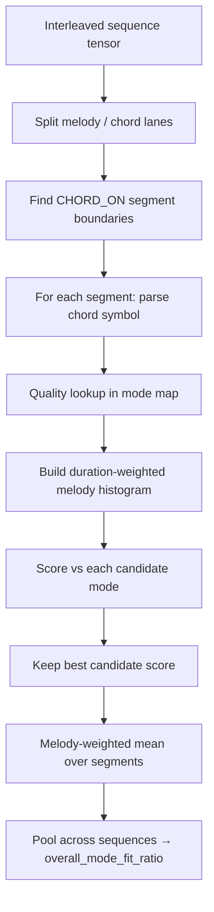

# Modal chord–scale mapping

Reference for `realchords/utils/modes.py`: chord quality → modal scale(s), for the
**note-in-mode** metric alongside note-in-chord (`eval_utils.py`).

**Framing:** harmony modally, chord by chord. Each quality maps to one or more of
21 parent-scale modes. No song key, no Roman numerals, no corpus statistics.

---

## Purpose

**Note-in-chord** (existing) checks melody pitch class against spelled chord tones —
strict, chord tones only.

**Note-in-mode** checks against a modal scale from chord–scale theory.
`Cmaj7` → Ionian or Lydian; `F7` → Mixolydian or Lydian dominant. Melody notes
outside the chord but inside the mode count as idiomatic.

The curated map (`chord_quality_mode_map.jsonl`) is the working definition.

---

## Artifacts

```bash
python -m realchords.utils.modes
```

| File | Role |
|---|---|
| `modes.py` | Implementation |
| `pitch_class_chord_map.jsonl` | 3–7 pitch classes → `note_seq` chord symbols (3,199 resolved, 24 unresolved) |
| `chord_quality_mode_map.jsonl` | **Curated** quality → modes (use this) |
| `chord_quality_mode_map_all.jsonl` | Exhaustive subset matches (reference) |

166 qualities from `data/cache/chord_names.json`, root stripped via
`extract_chord_quality()` (`Cmaj7` → `maj7`, `C` → `""`).

---

## Twenty-one modes

`list_scale_modes()` — seven rotations each of major, harmonic minor, melodic minor:

- **Major:** Ionian, Dorian, Phrygian, Lydian, Mixolydian, Aeolian, Locrian
- **Harmonic minor:** Harmonic minor, Locrian ♮6, Ionian augmented, Romanian minor, Phrygian dominant, Lydian ♯2, Ultralocrian
- **Melodic minor:** Melodic minor, Dorian ♭2, Lydian augmented, Lydian dominant, Mixolydian ♭6, Locrian ♯2, Altered

Each mode: `intervals`, `pitch_classes` (C root), `half_steps`. Lookups are
root-independent (mod 12).

---

## Mapping pipeline

Per quality: spell on C → pitch classes → find modes → curate → fallback if empty.

### 1. Exhaustive match

`chord_pitches ⊆ mode_pitches` — all mathematically possible modes. Written to
`chord_quality_mode_map_all.jsonl`.

### 2. Curated table

`CURATED_CHORD_QUALITY_MODES` in `modes.py` — hand-coded pedagogy (Nettles & Graf,
Levine, Berklee). First mode = `role: "primary"`, rest = `alternative`. Max 3 modes.

| Family | Modes (primary first) |
|---|---|
| `""` / `6` / `maj7` | Ionian, Lydian |
| `7` / `9` / `11` / `13` | Mixolydian, Lydian dominant |
| `m` / `m7` | Dorian, Aeolian |
| `m7b5` | Locrian, Locrian ♯2 |
| `o` / `o7` | Locrian, Locrian ♮6 |
| `+` / `sus` | Lydian augmented, Mixolydian, … |

Unknown qualities: strip extensions (`7(#9)` → `7`), else `FAMILY_MODE_PRIORITY`.

### 3. Intersect + narrow + filter

- **Intersect** curated candidates with exhaustive matches
- **Extension narrowing** on `#11`, `b13`, `#9`, `addb2` (e.g. `#9` → Altered,
  Phrygian dominant, Lydian ♯2)
- **Obscure filter** drops Ultralocrian, Lydian ♯2, Altered unless context warrants

### 4. Fallback chain (empty after curation)

1. `combinatorial` — exhaustive matches, no obscure filter (`(#9)` → Lydian ♯2)
2. `extension_hint` — alteration rules on all 21 modes (`7(#9)` → Phryg. dom., Lydian ♯2, Altered)
3. `best_overlap` — max shared pitch classes
4. `family_default` — family priority table

JSONL records include `"fallback": "<type>"` when used. All 166 qualities resolve
to ≥1 mode (66 curated, 80 combinatorial fallback, 20 extension_hint).

### Underdetermined sonorities

`ped`, `5`, ≤2 pitch classes: `"underdetermined": true`, skip curation, combinatorial
fallback (typically all 21 modes).

---

## JSONL fields

```json
{"chord_quality": "maj7", "pitch_classes": [0, 4, 7, 11],
 "modes": [{"name": "Ionian", "role": "primary"}, {"name": "Lydian", "role": "alternative"}]}
```

Optional: `underdetermined`, `fallback`.

---

## Examples

| Quality | Result |
|---|---|
| `maj7` | Ionian, Lydian (curated) |
| `7(#11)` | Lydian dominant (extension narrowing) |
| `(#9)` | Lydian ♯2 (`fallback: combinatorial`) |
| `7(#9)` | Phryg. dom., Lydian ♯2, Altered (`fallback: extension_hint`) |
| `ped` | All 21 modes (`underdetermined`) |

---

## Note-in-mode eval pipeline

Implemented in `realchords/utils/eval_utils.py` as
`evaluate_melody_mode_fit_ratio()`. It is run automatically by
`scripts/evaluate_generated_sequences.py` alongside note-in-chord and diversity
metrics; results land in `logs/eval/summary.json` as `overall_mode_fit_ratio`.

### Entry points

| Location | Role |
|---|---|
| `eval_utils.py` → `evaluate_melody_mode_fit_ratio()` | Core metric |
| `evaluate_generated_sequences.py` | Batch eval over generated `.pt` folders |
| `chord_quality_mode_map.jsonl` | Quality → candidate modes lookup |

CLI flags on the eval script: `--scoring` (`strict` / `coverage` / `distance`,
default `strict`), `--sigma` (default `1.5`, used only for distance scoring).

### High-level flow



Unlike note-in-chord (frame-level, strict chord tones), note-in-mode is
**segment-based**: one score per chord region, then aggregated.

### Step 1 — Segment the harmony

The chord lane is scanned for `CHORD_ON_*` tokens. Each onset starts a segment
that runs until the next chord change (or end of sequence). Melody frames in
`[start, end)` belong to that chord.

Segments are skipped when:
- the chord token cannot be parsed to a symbol
- the quality is missing from `chord_quality_mode_map.jsonl`
- the quality is **underdetermined** (`ped`, `5`, …) and
  `skip_underdetermined=True` (default)
- the segment has fewer than `min_melody_weight` melody frames (default `1.0`)

Sequences with no scorable segments return `NaN` and zero melody weight.

### Step 2 — Look up candidate modes

For each segment:
1. Parse `CHORD_ON_Cmaj7` → `Cmaj7`
2. Strip root → quality via `extract_chord_quality()` (`maj7`)
3. Load candidate modes from the JSONL entry
4. Transpose each mode's C-root pitch classes to the chord root

**Lenient policy:** all listed modes (primary + alternatives) are candidates.
The segment score is the **maximum** over candidates — equivalent to scoring
against the union of mode pitch classes, but via best-fit selection.

There is no separate “primary only” mode; use fewer modes in the map if you want
stricter behaviour.

### Step 3 — Melody histogram

Within each segment, every melody frame adds weight `1.0` to its pitch class
(mod 12). Held notes accumulate weight per frame, so longer notes count more.
Special tokens (`PAD`, `BOS`, `EOS`, `SILENCE`) are ignored.

### Step 4 — Segment scoring

Two scoring methods (`--scoring`):

| Method | Formula | Interpretation |
|---|---|---|
| `strict` (default) | `1` if every melody pitch in the segment is in at least one candidate mode, else `0` | All-or-nothing per chord region; sequence score is the unweighted mean over segments |
| `coverage` | `(weight on mode tones) / (total melody weight)` | Hard membership: fraction of melody in the mode |
| `distance` | `Σ w_pc · exp(−d² / 2σ²) / total_weight` | Soft membership: Gaussian on semitone distance `d` to nearest mode tone |

For each segment, score every candidate mode and take the **best** score
(`max`). Under `strict`, that means the segment passes if **any** listed mode
contains **all** melody pitch classes in the region.

### Step 5 — Sequence score

Per sequence (`strict`):

```
sequence_score = (# segments with all notes in some candidate mode) / (# scored segments)
```

Per sequence (`coverage` / `distance`):

```
sequence_score = Σ (segment_score × segment_melody_weight) / Σ segment_melody_weight
```

### Step 6 — System-level aggregation

`evaluate_generated_sequences.py` pools all sequences in all `.pt` files for a
system. Summary fields:

- `overall_mode_fit_ratio` — pooled score
- `total_mode_fit_segments` — number of chord regions scored (`strict`)
- `total_mode_fit_melody_weight` — total melody mass scored (`coverage` / `distance`)

When aggregating, sequences with `NaN` scores and zero weight are masked out
(`NaN × 0` would otherwise poison the sum).

### Example

Over a `Cmaj7` region with melody pitch classes `{C, D, E, G}` (equal weight):

| Metric | Score |
|---|---|
| Note-in-chord | 3/4 — `D` is not a chord tone |
| Note-in-mode (strict, Ionian/Lydian) | 1/1 — all notes fit Ionian |
| Note-in-mode (strict, wrong chord) | 0/1 — one out-of-mode note fails the segment |

### Comparison to note-in-chord

| | Note-in-chord | Note-in-mode |
|---|---|---|
| Unit | Per frame | Per chord segment |
| Reference | Spelled chord tones | Modal scale(s) from quality map |
| Strictness | Binary tone membership | Continuous `[0, 1]` |
| Key / function | N/A | N/A — local chord-by-chord |

Both metrics share the same interleaved input format and `sequence_order`
(`chord_first` / `melody_first`).

---

## Out of scope

- Song key (`keys_overview.json` exists but unused)
- Roman numerals / functional harmony
- Corpus-driven mode frequencies
- Voicing / register (pitch-class sets only)

---

## Sources

Nettles & Graf 2015; Levine 1995; Mulholland & Hojnacki 2013; Haerle 1982;
Russell 1953/2001; [Open Music Theory — chord–scale theory](https://viva.pressbooks.pub/openmusictheory/chapter/chord-scale-theory/).

Curated table: `CURATED_CHORD_QUALITY_MODES` in `modes.py`.
