**Article** <https://doi.org/10.1038/s42256-026-01279-9>

# **Machine learning of artistic fingerprints in jazz**

**Huw Cheston  1,2 , Reuben Bance  1 & Peter M. C. Harrison 1**

Artists are often recognizable through collections of distinctive patterns ('fingerprints') in their work. Identifying such traits has important applications in authorship attribution, education, cultural heritage research and historical analysis. Here we focus on music, a domain with a rich tradition of theoretical and mathematical analysis. We train a variety of supervised learning models to identify 20 iconic jazz musicians from a curated dataset of 84 h of recordings. In particular, we introduce a multi-input architecture that represents four musical domains separately: melody, harmony, rhythm and dynamics. This design allows us to accurately identify individual performers (our best model obtains 94% accuracy across 20 classes) and to examine which musical elements most strongly distinguish between individual artists. We release open-source implementations of our models and an accompanying web application for exploring our results.

What distinguishes one artist from another? This question lies at the heart of arts scholarship. In the visual arts, distinguishing cues might include subject matter, colour palette and brushwork; in literature, vocabulary, syntactic patterns and narrative archetypes; and in music, harmonic progressions, rhythmic structures and melodic motifs. When multiple authorial cues are considered together, they come to make up the distinctive authorial fingerprint of an artist.

Some of these cues are perceptible to humans, even for a relatively untrained eye or ear: for example, the way a painter renders light at the edge of a shadow, or a novelist's habitual reliance on certain words or sentence structures. With training, humans can learn to identify more subtle authorial cues, such as slight differences in word distributions between two writers[1](#page-10-0) . Other artistic cues may lie outside the realm of immediate human perception: for example, the chemical composition of the paint used in an artwor[k2](#page-10-1) , or the microtiming deviations in a musician's performance[3](#page-10-2) .

Perceptible or not, artistic fingerprints have several useful applications. First, they have practical uses, for example, suggesting possible authors for unattributed work[s1](#page-10-0)[,4](#page-10-3),[5](#page-10-4) or distinguishing authentic pieces from forgeries[2](#page-10-1) . Second, they can highlight the networks of influence between artist[s6](#page-10-5)[,7](#page-10-6) , as well as reveal insights into the creative process itsel[f8](#page-10-7),[9](#page-10-8) . For example, the chemical make-up of the paint in an artwork can point to where particular materials were purchased, situating the work within a specific time, place and artistic community. Finally, they can also be useful in educational contexts, helping to train artists to understand the distinctive voices of important figures within their particular discipline.

Identifying these components has been a central task within many scholarly accounts of visual ar[t10](#page-10-9),[11,](#page-10-10) musi[c12–](#page-10-11)[14](#page-10-12) and writin[g15,](#page-10-13)[16](#page-11-0) from the past century and earlier. However, traditional manual methods of analysis are necessarily slow and, hence, hard to apply at scale. Consequently, such research is mostly restricted to a small minority of famous artists from the Western canon, such as Beethoven[12](#page-10-11), Cervante[s16](#page-11-0), Dant[e15](#page-10-13) and Raphae[l11](#page-10-10).

Machine learning provides a more scalable method for learning artistic fingerprints. The standard approach is to train a supervised learning model to identify the creator of an artwork from a given input. Recent deep neural networks perform very well at this task, reaching a high degree of accuracy when identifying visual artist[s17](#page-11-1), writer[s4](#page-10-3)[,5,](#page-10-4)[18,](#page-11-2) composer[s19](#page-11-3)[–23](#page-11-4) and performers[24](#page-11-5)[–26](#page-11-6) from their works. However, such models can be hard for humans to interpret, constraining their general utility for elucidating the creative processes or for contributing to pedagogy. An important current challenge is, therefore, to develop approaches that achieve both high predictive accuracy and are straightforward to interpret.

Received: 10 April 2025

Accepted: 1 July 2026

Published online: 17 August 2026

 [C](http://crossmark.crossref.org/dialog/?doi=10.1038/s42256-026-01279-9&domain=pdf)heck for updates

1 Centre for Music and Science, University of Cambridge, Cambridge, UK. 2 Centre for Digital Music, Queen Mary University of London, London, UK.

e-mail: [hwc31@cam.ac.uk](mailto:hwc31@cam.ac.uk); [pmch2@cam.ac.uk](mailto:pmch2@cam.ac.uk)

**Bag of features: who is the performer of an unknown musical piece?** We show the accuracy of the three models in predicting the held-out test data in Extended Data Table 1. The LR model (with L2 or 'ridge' regularization as the penalty term) performs the best, achieving a top-1 accuracy of 0.767 when predicting the identity of the 20 jazz pianists considered here. The top-5 accuracy for this model is 0.939—meaning that for nearly 95% of unseen recordings, the actual pianist is within the five classes with the highest predictive probability estimated by this model, despite it only using melodic *n*-grams and chord voicings as input features. The RF and SVM models both perform worse, achieving top-1 accuracies of 0.454 and 0.687 on the held-out test data, respectively[39](#page-11-7). Additionally, we find that models trained on chromatic-scale steps perform substantially better than those trained on diatonic-scale steps, even when controlling for the use of mode by each pianist (Supplementary Section 1.1.3).

**Bag of features: which domains matter in a musical fingerprint?** One way of ascertaining the relative importance of the input features used by these models is to calculate the decrease in predictive accuracy when the values obtained for a feature (or group of features) are permute[d40](#page-11-8). We compute feature importance by permuting either all harmony or all melody features and measuring the loss in the held-out test accuracy for the LR versus predicting with the complete feature set. The accuracy loss (averaged over *N* = 1,000 iterations) when permuting melodic features is substantially greater than permuting chord features (0.403 versus 0.152). Similar trends are observed for both optimized RF and SVM models (Extended Data Fig. 1). This might suggest that melodic patterns are more important than chord voicings in differentiating one jazz pianist from another.

Given the imbalance in the number of features (with over twice as many *n*-grams than voicings), an alternative way to consider the importance of a single feature is to permute random subsets of *K* melodic patterns or chord voicings (sampled without replacement from the full feature space) and measure the mean loss in accuracy. With *K* = 2,000 features, the loss in accuracy for the LR is larger when permuting chord voicings than when permuting melodic patterns (0.015 versus 0.057: mean across *N* = 1,000 iterations). This would suggest that the typical chord voicing has over three times the explanatory power of the typical melody *n*-gram; however, as the vocabulary of melody *n*-grams is so much larger than the vocabulary of voicings, melody *n*-grams still end up more predictive on aggregate than chord voicing[s39.](#page-11-7)

**Bag of features: how do musical fingerprints differ between performance contexts?** Another question we can ask is whether there are differences in how musical features are used in either solo or ensemble performances. To do so, we refit the LR model separately on solo (����solo) and ensemble (����trio) recordings, using the top-*K* melodic and harmonic features, and compute Pearson correlation coefficients between the rows of the resulting weight matrices for every performer (see the 'Extracting maximally predictive features' section). In nearly every case, these correlations are positive: for melody, mean(*r*) = 0.267, s.d. = 0.108; for harmony, mean(*r*) = 0.150, s.d. = 0.087 (Fig. [1\)](#page-2-0).

To the extent that melodic or harmonic cues differ between solo and ensemble performances, we would expect correlations to be lower across the dataset partitions (that is, between ����solo and ����trio) than within partitions. To test this hypothesis, we conduct a one-sided (left-tailed) permutation-based significance test, which involves randomly shuffling the labels within the dataset before obtaining ����solo and ����trio. This yields a Monte Carlo null distribution of correlation coefficients for every performer (*N* = 1,000 iterations) against which we test our observed correlations. We apply Bonferroni correction for the number of feature sets (that is, *n* = 2), thereby controlling the false discovery rate on the performer level. These tests indicate that the correlation between feature weights obtained from either dataset are

Although this question has been studied extensively in both visual art[9](#page-10-8),[17,](#page-11-1)[27](#page-11-9) and writing[1](#page-10-0)[,4](#page-10-3),[18,](#page-11-2) relatively little has been done in the musical domain. Here we address jazz improvisation, which provides a particularly rich manifestation of artistic style, combining three essential aspects of musical creativity: composition (the aspects of the piece that are written in advance), improvisation (how the composed ideas are spontaneously fleshed out and extended) and performance (how these ideas are realized physically, in conjunction with the other musicians). Each of these three elements can become part of a performer's fingerprint, as has been elucidated in numerous theoretical writing[s14](#page-10-12)[,28–](#page-11-10)[31](#page-11-11).

Computational analysis of jazz has historically been difficult. Most jazz performances only exist as audio recordings, and models trained directly on audio are typically hard for humans to interpre[t26,](#page-11-6)[32](#page-11-12). They may also focus overly on contextual elements (for example, recording quality) rather than the features (harmonic or melodic vocabulary) generally of interest to musicians[33](#page-11-13)[,34](#page-11-14). However, recent developments in audio signal processing allow us to bring this work into the symbolic domain[35,](#page-11-15)[36,](#page-11-16) which supports a much more interpretable analysis.

We take advantage of these possibilities in the present work, developing models to address many issues relevant to music theorists, performers and educators. These include

- Which musical cues (for example, individual melodic patterns or harmonic progressions) make up a given performer's fingerprint?
- How do these cues vary between performance contexts (for example, playing in an ensemble versus unaccompanied)?
- How are the fingerprints of different performers related?
- How do machine-extracted authorial cues relate to cues identified by human experts, as published in the existing analytical literature?

To gain a balanced perspective on these questions and to avoid over-generalizing from one architecture[37](#page-11-17),[38,](#page-11-18) we consider a variety of machine learning models in turn. Each model is trained to predict performer identity from a different input representation, across a large dataset of transcribed recordings by 20 famous jazz pianists (see the 'Dataset' section). One approach (see the 'Bag of features approach' and 'Training the bag of features approach' sections) uses large 'bags' of basic musical elements (melodic *n*-grams and musical chords); a second approach (see the 'Representation learning approach' and 'Training the representation learning approach' sections) learns a black-box representation from the music transcription; a third, intermediate approach (see the 'Multiple input representations approach' and 'Training the multiple input representations approach' sections) learns separate representations for four fundamental musical dimensions, namely, melody, harmony, rhythm and dynamics.

To contextualize what our models have learned, we interpret their behaviour in light of existing pedagogical and musicological writings. The approach, therefore, provides a way to test claims about authorial cues made in prior literature. Moreover, by validating our models against existing analyses of well-studied artists, we gain confidence that the models could deliver worthwhile analyses when generalized to less well-studied artists. To support such applications in the future, we release open-source implementations and checkpoints for our models, in the hope that they can be used to explore both new and under-researched musical works (see the 'Code availability' section).

# **Results**

### **Bag of features approach**

We train three classical supervised learning architectures (logistic regression (LR), random forest (RF) and support vector machine (SVM)) to identify the pianist playing in each recording, using a bag of distinct features, corresponding to individual melodic patterns (*n*-grams) and chord voicings (see the 'Training the bag of features approach' section).

substantially smaller than would be expected if the two datasets were equivalent.

**Bag of features: which features are associated with particular performers?** Although this analysis is interesting in terms of relatively high-level musical musical cues, it does not tell us which features influenced the model to classify individual performers—in other words, which melodic patterns or chord voicings best define the vocabulary of one particular performer. Ref. [41](#page-11-19) explored this task by ranking how frequently different jazz improvisers used particular melodic patterns. Similarly, ref. [42](#page-11-20) defined the distinctiveness of a pattern within a musical corpus as the degree to which it is over-represented with respect to an anti-corpus.

We take a different approach by instead formalizing the 'distinctiveness' of a given musical feature for a particular performer using the weights it is associated with by our model. This helps mitigate the influence of patterns or voicings that are commonly used by all performers in the dataset, avoiding the need to explicitly define an anti-corpus.

After fitting the LR model to the entire dataset, we obtain the matrix **W** (see the 'Extracting maximally predictive features' section). Each entry **W***i*,*j* represents the weight assigned to feature *j* ∈ *J* for performer *i* ∈ *I*. A positive weight **W***i*,*j* > 0 indicates that the presence of feature *j* increases the likelihood of predicting performer *i*; conversely, a negative weight **W***i*,*j* < 0 decreases that likelihood. In Fig. [2](#page-3-0), we show weights for the top- and bottom-five melodic patterns associated with classifications of Bill Evans and Oscar Peterson—the two pianists with the greatest number of individual recordings in the dataset (see the 'Dataset' section). We provide similar graphs for all other pianists in Supplementary Figs. 5–22, several of whom we discuss in Supplementary Section 1.2. The five most distinctive melodic patterns for each pianist can also be listened to within the context of their performances as part of an interactive web application we have developed (see the 'Code availability' section).

For Bill Evans, two of the five patterns with the strongest weighting outline either a descending major (0, −4, −7, −11) or minor (0, −3, −7, −10) seventh arpeggio, beginning on the seventh and falling to the root (Supplementary Figs. 43 and 44). Both patterns appear frequently in jazz pianist Jacky Naylor's pedagogical textbook outlining Evans'

improvisation styl[e43.](#page-11-21) Evans uses this pattern considerably more than any other pianist in our dataset, with it appearing 128 times across his recordings; other pianists who frequently use this pattern include Keith Jarrett (34 appearances) and Brad Mehldau (33).

Several of the patterns with the strongest weighting for Oscar Peterson can be considered melodic 'enclosures'. For example, the pattern (0, −2, −4, −3) is described in ref. [44](#page-11-22) on Peterson's style as a 'chromatic enclosure around the third', approaching the major third of the underlying harmony from above and then below (Supplementary Fig. 45). Again, Peterson uses this pattern the most of any pianist in our dataset (146 appearances). Others who use this pattern frequently include Kenny Barron (94) and Keith Jarrett (97). The (0, 7, 4, 5) pattern associated with Peterson also acts as a 'scale note enclosure['44](#page-11-22), approaching the note a perfect fourth above the starting pitch diatonically from above and then below (Supplementary Fig. 46).

Many of the melodic patterns with strong positive weights are, perhaps, well known to musicians. However, we also wish to draw attention to the patterns with negative weightings: in other words, the features that particular performers do not seem to use. For Evans, these include octave tremolo figures that appear prominently in the 'bluesy' playing of both Peterson and Junior Mance (Supplementary Fig. 14); for Peterson, these patterns include unidirectional scalar patterns that avoid the kinds of disjunct motion typically found in melodic enclosures. In contrast to the features with positive weights—which, as we have already demonstrated, appear often in the pedagogical literature—these negatively weighted patterns could capture avoidance behaviours, which are rarely made explicit in previous work.

**Bag of features: how are the fingerprints of particular performers related?** These preceding analyses focused on individual *n*-grams, but it is also possible to use dimensionality reduction to visualize larger-scale clusters of *n*-gram usage. Here we use principal component analysis (PCA; Supplementary Section 1.3); we apply it to melodic *n*-grams of length 4, of which there are 5,838. In Fig. [3,](#page-4-0) we plot all performer classes and a subset of the melodic patterns that load most strongly onto the first four principal components. In Supplementary Fig. 54, we show the number of times each performer uses the three patterns that load most strongly onto both components 1 and 2. Additional analysis of the remaining components is contained in Supplementary Section 1.3.

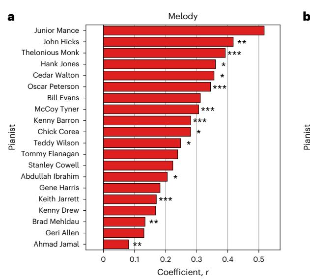

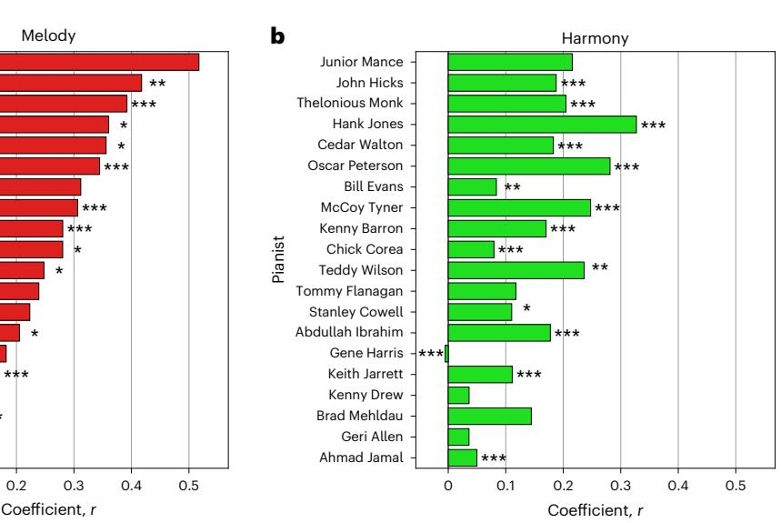

**Fig. 1 | Relationships between databases. a**,**b**, Correlation coefficients obtained between the weights of every performer for models fitted using melodic patterns (**a**) and chord voicings (**b**). Performers are sorted in the descending order of magnitude according to the correlations in **a**. Asterisks show the results of a

one-sided (left-tailed) permutation-based significance test (*N* = 1,000 iterations) of the observed coefficients (\**P* < 0.05, \*\**P* < 0.01, \*\*\**P* < 0.001), with Bonferroni correction applied to control for multiple comparisons (using *n* = 2).

Melodic patterns that load positively onto principal component 1 typically consist of small scalar fragments with a span of less than a perfect fifth, such as (0, 1, 3, 5) and (0, 2, 3, 5). Keith Jarrett, Tommy Flanagan and Kenny Barron load positively onto this component. Supplementary Fig. 22 shows how Flanagan uses several of these melodic patterns. Patterns that load negatively onto component 1 span a much larger distance, such as (0, 1, 6, 1) and (0, 1, 2, −9), with Abdullah Ibrahim, Ahmad Jamal and Thelonious Monk also loading negatively here.

Melodic patterns loading positively onto component 2 involve chromatic fragments such as (0, −1, −2, −3) and (0, −1, −3, −2). Bill Evans loads positively onto this component; Supplementary Fig. 43 shows him using (0, −1, −2, −3) to connect sequential appearances of (0, −4, −7, −11). Patterns loading negatively onto component 2 consist of the same interval alternating, including (0, 5, 0, 5), with Brad Mehldau, Junior Mance and McCoy Tyner loading negatively. Many of these negatively loading melodic patterns resemble ostinato figures typically played by a bassist, which may explain Mehldau's association with them, given that most of his recordings in our dataset are unaccompanied. Most patterns also alternate between perfect intervals, including fourths (0, 5, 0, 5) and octaves (0, 12, 7, 12), associated with Tyner (Supplementary Fig. 18) and Mance (Supplementary Fig. 14), respectively.

### **Representation learning approach**

One weakness of the bag of features approach is that it is difficult to be certain that a feature 'bag' includes all features that might be beneficial for a model. We did not consider, for example, how the arrangement of different chords in sequence might impact voice leading, which is a skill that many jazz pianists devote substantial time to mastering[29](#page-11-23)[,45,](#page-11-24)[46.](#page-11-25)

Consequently, rather than defining the feature space in advance, it may be attractive to allow the model to learn a representation directly from an input, which can then be used in classification. We evaluate two neural network architectures (a convolutional recurrent neural network (CRNN) and a 'ResNet') on our dataset. These models are trained directly on the 'piano rolls' transcribed from each recording (see the 'Training the representation learning approach' section).

**Representation learning: who is the performer of an unknown musical piece?** We show the accuracy of each model when predicting the performer of an unseen test recording (Extended Data Table 2). The best-performing model from these experiments is the ResNet trained using our data augmentation pipeline (accuracy, 0.944). This model considerably outperforms both the previous-best LR model (0.767) and the CRNN with augmentation (0.825), and can be considered to

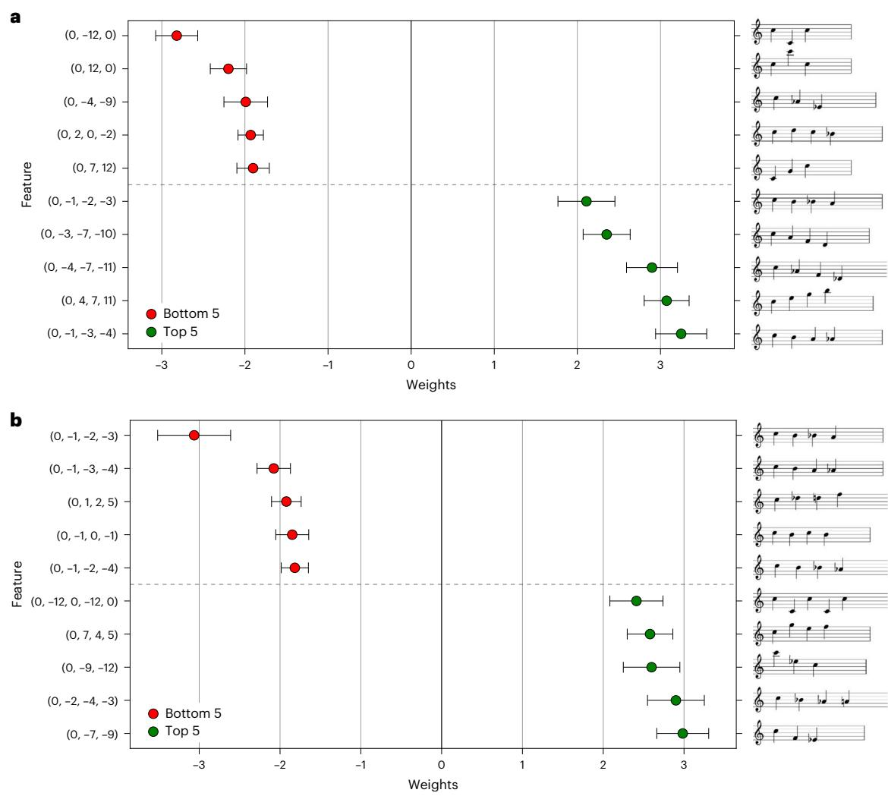

**Fig. 2 | Predictive melodic patterns. a**,**b**, Weights obtained for the top- and bottom-five melody *n*-grams associated with classifications of Bill Evans (**a**) and Oscar Peterson (**b**). Data are presented as regression coefficients with the error bars showing ±1 s.e., calculated by bootstrapping the dataset used to fit the LR

model (*N* = 1,000 iterations). The corresponding musical notation for every *n*-gram is on the right, transposed such that the first note is C and the mean pitch height is approximately centred around G4. The pitch spelling for each feature is estimated using the algorithm described in ref. [84](#page-12-0).

set a strong baseline for automatic performer identification models on this dataset.

**Representation learning: which features are associated with particular performers?** We use the locally interpretable model explanations (LIME) technique[47](#page-11-26) to interpret test-split predictions made by the ResNet trained with augmentation. We use the default settings in the Python library (v. 0.2.0.1) provided by the authors of the original paper. Figure [4](#page-5-0) highlights the four regions with the strongest LIME attributions (that is, that push the model to positively identify the target class) for clips by Bill Evans and Oscar Peterson. Similar figures for clips by Abdullah Ibrahim, Chick Corea and Keith Jarrett are provided in Supplementary Fig. 55.

The LIME technique does seem to emphasize musical gestures that could reasonably be considered distinctive for each performer. These include particular ascending and descending melodic patterns for Evans and several chord voicings for Peterson: interestingly, in the case of Evans, one of the attributed regions even contains the descending (0, −4, −7, −11) arpeggio observed previously in Fig. [2a.](#page-3-0) Nonetheless, it is difficult to understand exactly what aspects of those gestures the model is paying attention to. Considering several of the scalar patterns highlighted for Evans, their explanatory power could reasonably derive from the intervallic structure of the scale, the harmony that it outlines, or the rhythmic and dynamic trends that shape it.

# **Multiple input representations approach**

As one possible solution to the opaqueness of techniques like LIME, we now evaluate an architecture that learns separate representations for four fundamental musical domains—melody, harmony, rhythm and dynamics[48](#page-11-27)—but then combines information from these four domains to make its predictions (see the 'Training the multiple input representations approach' section). Each domain is represented as a piano roll with the same shape as the original transcription. We then train small convolutional sub-networks to learn from each representation and aggregate the outputs together to generate a single feature vector that can be used to make predictions (Extended Data Fig. 2), as in ref. [49](#page-11-28).

**Multiple input representations: who is the performer of an unknown musical piece?** The results for this approach are shown in Extended Data Table 3. The best-performing multi-input model almost matches the performance of the best model described in the 'Representation learning approach' section (accuracy of 0.913 versus 0.944). There is, therefore, some trade-off between interpretability and predictive performance, at least in our case. However, it is impressive that the multi-input model can nearly match the baseline set in the 'Representation learning: who is the performer of an unknown musical piece?' section, and vastly outperforms the models introduced in the 'Bag of features: who is the performer of an unknown musical piece?' section.

**Multiple input representations: which musical domains contribute the most towards accurate performer identification?** There are at least two ways to evaluate the high-level musical domains this model is trained on. The first considers how important each representation is to the full model by computing the loss in accuracy when the output of a single sub-network is masked with zeros (Fig. [5a\)](#page-5-1). Masking either the melody, rhythm or harmony sub-network leads to a small, relatively consistent drop in accuracy, with the greatest loss observed for rhythm (rhythm accuracy loss, −0.069; melody, −0.063; harmony, −0.056). However, masking the output of the 'dynamics' sub-network leads to a considerably smaller loss in accuracy (−0.019), which suggests that the dynamics are relatively unimportant when predicting the performer of an unknown musical excerpt.

A second way to consider the contributions of each domain is to compute how well a single representation predicts by itself, when the output of the other three sub-networks is masked (Fig. [5b](#page-5-1)). As before, the predictive accuracy is the lowest when using only the dynamics sub-network (accuracy, 0.263)—and is only slightly better than a model that simply predicts the majority class (0.175). Both melody

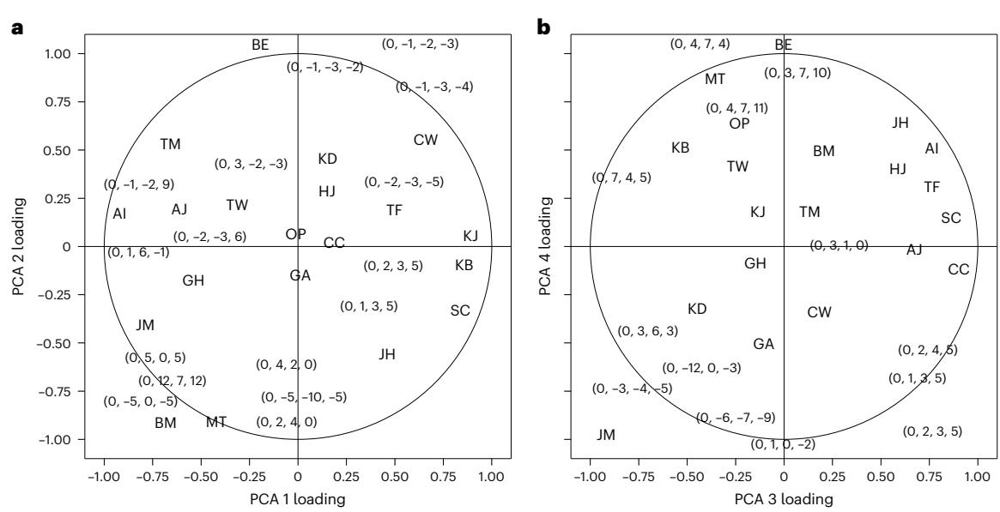

**Fig. 3 | PCA projections. a**,**b**, Horizontal and vertical axes show the melody feature and performer projections, respectively, onto principal components 1 and 2 (**a**) and components 3 and 4 (**b**). Values are linearly scaled separately for each dimension to within the range (−1, 1). Each melody feature shows the number of semitones relative to the initial note 0. To select the melodic patterns to plot, we divide the two-dimensional representation into quarters and within each plot, we use the four patterns with the highest absolute magnitudes.

Performers are shown by their initials: JM, Junior Mance; JH, John Hicks; TM, Theolonious Monk; HJ, Hank Jones; CW, Cedar Walton; OP, Oscar Peterson; BE, Bill Evans; MT, McCoy Tyner; KB, Kenny Barron; CC, Chick Corea; TW, Teddy Wilson; TF, Tommy Flanagan; SC, Stanley Cowell; AI, Abdullah Ibrahim; GH, Gene Harris; KJ, Keith Jarrett; KD, Kenny Drew; BM, Brad Mehldau; GA, Geri Allen; AJ, Ahmad Jamal.

and rhythm sub-networks yield similar predictive accuracies (0.575 and 0.619, respectively). The most accurate predictions are obtained using only the harmony sub-network, with nearly three-quarters of unseen recordings being classified correctly (0.744). We show the predictive accuracy obtained for all combinations of sub-networks in Supplementary Fig. 56.

The importance of melodic content for distinguishing between different improvising jazz musicians has been demonstrated previously in the literature on computational modellin[g50](#page-11-29)[,51.](#page-11-30) The same is also true for rhythm[3](#page-10-2) , with ref. [52](#page-11-31) noting how 'expressive features of "time feel" serve to define the stylistic profile of [particular] jazz musicians'. Finally, that harmony should be particularly helpful when predicting an unknown performer is perhaps unsurprising: in his monograph on jazz, Gridle[y53](#page-11-32) describes how 'each pianist's particular approach to… chording [is] a signature for [their] style'.

**Multiple input representations: which domains best distinguish particular performers?** In Extended Data Figs. 3 and 4, we show the per-class accuracy for predictions made using a single sub-network, which allows us to consider the degree to which particular domains best distinguish individual performers. For instance, several musicians are particularly distinctive for their use of rhythm. This includes Kenny Barron and Chick Corea, as all of their recordings in the held-out test set can be correctly classified solely using the rhythm sub-network, with considerably lower accuracy obtained when using only the harmony sub-network (0.800 for Kenny Barron and 0.714 for Chick Corea). A possible explanation could be that Corea is one of the only pianists in our dataset to have extensively recorded Latin American music[54](#page-11-33). The distinctiveness of every domain for each performer can be explored as part of our interactive web application (see the 'Code availability' section).

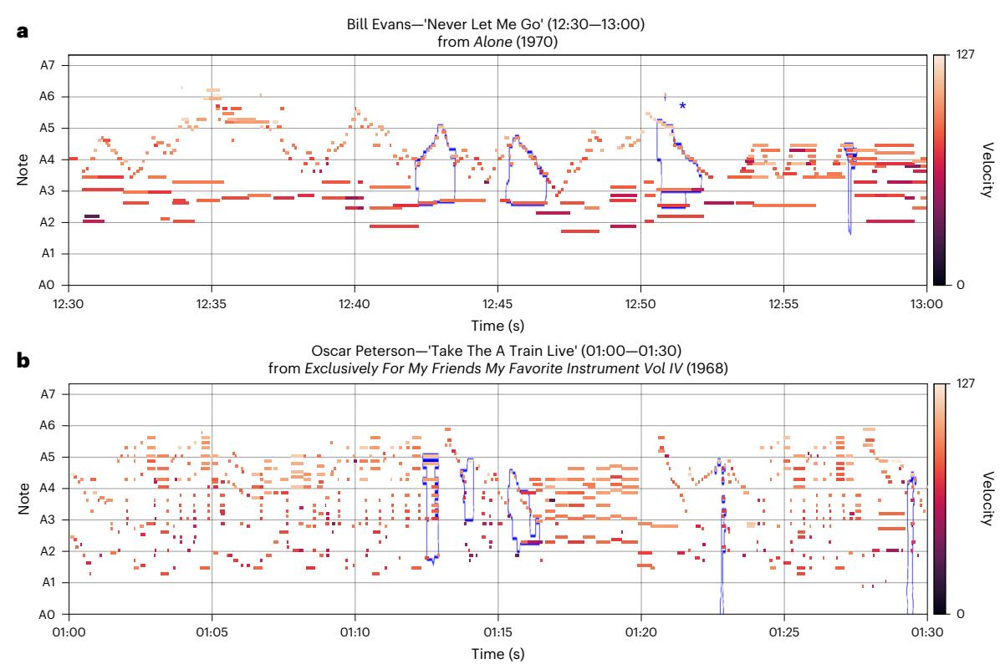

**Fig. 4 | LIME piano rolls. a**,**b**, Single clip from a performance by Bill Evans (**a**) and Oscar Peterson (**b**). The five areas of the piano roll that contribute the most towards predicting the target label are highlighted in blue. The asterisk in **a** indicates the descending arpeggio (0, −4, −7, −11) pattern identified in Fig. [2.](#page-3-0)

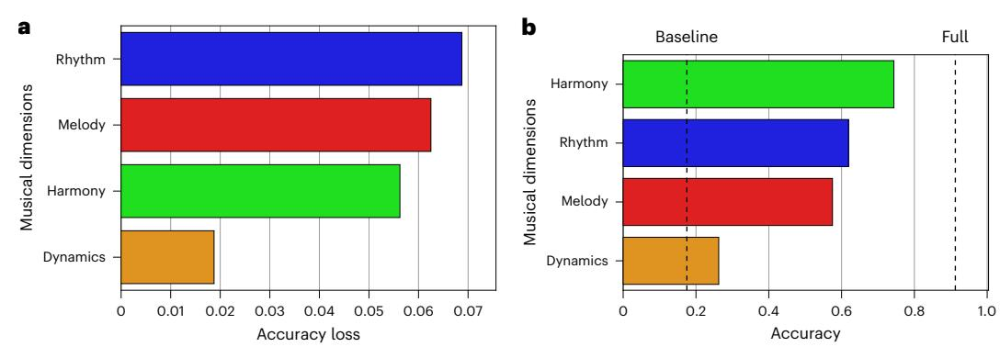

**Fig. 5 | Multi-input model evaluations. a**, Loss in accuracy compared with the full model when masking a single sub-network. **b**, Accuracy of predictions made using only a single sub-network. The dotted lines in **b** show the accuracy from predicting the majority class and the accuracy of the 'full' model (using all four sub-networks).

# **Discussion**

The purpose of this research was to deconstruct the fingerprints of individual artists—the signature elements that make their work recognizable and distinct—by comparing the outputs of machine learning models trained on particular artworks with expert human analyses found in the scholarly literature. This computational approach to the analysis of art has several intrinsic benefits. Human experts can identify fingerprints within small numbers of individual artworks[28.](#page-11-10) Our computational modelling, however, allows much larger datasets to be processed (see Fig. [6\)](#page-7-0), and it offers a level of statistical rigour that is unobtainable with manual approaches. Indeed, we find that many of the features highlighted by the model align with prior observations in the theoretical literature, and this provides a useful validation of the approach (for example, see the patterns shown in Fig. [2\)](#page-3-0). However, other important features are not discussed at all in the existing literature, and our models provide straightforward ways to identify them.

Our work also carries pedagogical implications. Critical writing on art often relies on language (for example, 'swing', 'groove' and 'feel' in jazz) that describes particular artists, yet finding clear examples here can be challenging. We have demonstrated that computational models can automatically associate performers with distinctive features, with interesting implications for demystifying their playing. To this end, we have also created a web application (see the 'Code availability' section) that enables users to explore the playing of the 20 pianists considered here.

We can foresee at least two limitations with this work. First, musical dimensions overlap somewhat, making complete separation difficult, as presumed by our multi-input model. For example, harmony is seemingly the most helpful domain for this model when used on its own, whereas rhythm is the most important when all other domains are included (Fig. [5](#page-5-1)). One possible interpretation could be that some melodic information bled into the harmony representation, and vice versa. Although perfect separation may be impossible, treating these as distinct constructs can yield insights harder to obtain from fully entangled representations, as demonstrated in the LIME analysis (Fig. [4\)](#page-5-0).

Second, the inputs themselves carry limitations. MIDI piano rolls are widely used by musicians and lend themselves to meaningful interpretation—unlike auditory representations such as spectrogram[s32.](#page-11-12) However, they necessarily constrain the musical information that can be learned. Although this can mitigate any potential overfitting to recording- or performer-level characteristics (Supplementary Section 1.4), jazz improvisation engages with tonal and timbral qualities that MIDI cannot easily capture, like vibrato and pitch-bending[51.](#page-11-30) A revised pipeline applied to instruments such as the saxophone would need to engage with these musical techniques. Additionally, extending the pipeline to double bas[s55,](#page-11-34) for instance, would allow us to examine how that instrument shapes the harmonic function of the chord voicings (see the 'Bag of features approach' section).

This work nonetheless unlocks several exciting avenues for further research. Beyond individual artists, fingerprints can be examined through geographical, historical and cultural lenses—for instance, the 'Detroit school' of pianists, including Tommy Flanagan and Hank Jones[54](#page-11-33). Our models could investigate such networks by studying the evolution and transmission of distinctive musical cues over time or across location[s7](#page-10-6)[,56](#page-11-35)[,57.](#page-11-36) Training equivalent models on classical performances would enable cross-genre comparison[s58.](#page-11-37) Alternative methods—such as concept-based techniques[32—](#page-11-12)could also be applied to our multi-input model's representations. Future research could also be conducted into improving methods for automatic scale estimation in polyphonic jazz (Supplementary Section 1.1), which could improve the performance of models trained on diatonic (versus chromatic) scale steps (Extended Data Table 1). Finally, our models could be extended to less well known or historically under-represented musicians.

# **Methods**

# **Dataset**

Our dataset consists of the recordings of jazz piano improvisation by 20 famous performers, transcribed using an automatic system into MIDI 'piano roll' format. We study both group and solo performances, which are known to differ in systematic ways. For instance, in jazz, the piano shares responsibility with the bass and drums for defining the harmonic and rhythmic movement of a performanc[e28.](#page-11-10) When a pianist performs unaccompanied, they may need to compensate for the absence of the other instruments, such as by emphasizing harmonically 'fuller' chords or bass line[s29](#page-11-23),[45.](#page-11-24)

**Source datasets.** We use transcriptions from two existing open-source datasets: (1) the jazz trio database ( JTD[\)59](#page-11-38) and (2) the piano jazz with automatic MIDI annotations[33](#page-11-13) dataset. JTD contains transcriptions of 1,294 improvised solos by 34 different jazz pianists performing in a trio with a bassist and drummer. Suitable performers were identified from online listening data and pedagogical textbooks, with all recordings from their discographies that met a predefined inclusion criteria (for example, instrumentation and musical attributes) included in the dataset. PiJAMA contains transcriptions of 2,777 full-length performances by 120 different pianists, without accompaniment. Suitable performers were identified from both textbooks and records of finalists in international jazz competitions, with all available performances by these pianists included in the dataset. Note that as JTD and PiJAMA contain recordings of different types of jazz performance (solo and trio) identified manually by the dataset creators, combining both together is highly unlikely to introduce contamination (that is, same recordings contained in both datasets).

**Transcription and preprocessing.** The transcriptions for both datasets were created by applying the automatic music transcription system described by ref. [36](#page-11-16) to an audio signal. This model was the state-of-the-art system made available openly at the time both datasets were compiled. For the recordings in PiJAMA, an automatic music tagging system was first used to filter out non-music portions of the audio (for example, applause and spoken introductions), with the transcription model applied to the remaining sections. For the recordings in JTD, the audio was manually trimmed to the piano solo; a state-of-the-art, open-source instrument separation mode[l60](#page-12-1) was applied to isolate the playing of the pianist; and the transcription model was then applied to the separated audio. The transcriptions in both datasets were created at a resolution of 100 frames per second (that is, 10 ms per frame), the default setting for the transcription model.

Reference [33](#page-11-13) found that the transcription pipeline used in PiJAMA obtained an average note *F*1 score of 0.87, compared with a small corpus of hand-curated jazz piano transcriptions. Reference [39](#page-11-7) found an average note onset *F*1 score for JTD of 0.82, compared with a small hand-annotated sample of recordings from this dataset. Both results indicate good performance for an automatic piano transcription model and are similar to those obtained when applying the same pipeline to datasets of Western classical musi[c33](#page-11-13).

Additionally, to counter several of the common failure states of automatic transcription models, we preprocess our dataset. We remove any notes with a pitch outside the standard range of the piano (that is, lower than 21 and higher than 108) or that have a duration shorter than 10 ms, which were generally artefacts. We merge together notes played at the same pitch, but with less than 10 ms between successive offset and onset times ('false triggers'). Finally, we clamp notes to a maximum duration of 5 s—which proved necessary due to a minority of cases (0.22% of notes in the dataset) in which the automatic transcription model failed to correctly apply note-off events. Further preprocessing and heuristics specific to each model are described in the 'Bag of features approach', 'Representation learning approach' and 'Multiple input representations approach' sections.

Finally, we note that the annotations in JTD and PiJAMA are solely restricted to performance MIDI. By contrast, the Weimar jazz database[61](#page-12-2) contains additional annotations, including chord symbols and section annotations. Our datasets make up for this, however, with their substantially larger size—with PiJAMA alone being over six times the size of WJD.

**Data splits.** Twenty-five different pianists have at least one recording in both datasets (Fig. [6a](#page-7-0)). However, the cumulative duration of all recordings varies substantially between performers, from less than half an hour to over nine hours (Fig. [6b\)](#page-7-0). Consequently, we remove pianists with less than 80 min of recordings across JTD and PiJAMA. This leaves 1,629 performances by 20 pianists, with a total duration of 84 h. Our dataset includes a greater number of recordings from JTD (1,001) than PiJAMA (628). However, the PiJAMA recordings (which are all full-length performances) are typically longer than those in JTD (which consist only of the piano solo in a recording), with a median duration of 4 min 18 s versus 1 min 51 s (Fig. [6c\)](#page-7-0).

We randomly split these recordings into training, validation and test subsets in the ratio of 8:1:1. These splits are stratified by source database, such that a proportional number of solo and ensemble performances are included in each subset. We use these splits to train and evaluate all of the models described in the remainder of the paper. Note that we find no evidence for either the 'album' or 'composition' effect[34](#page-11-14) when training our models on these splits (Supplementary Section 1.4).

For the models described in the 'Bag of features approach' section, features are extracted from an entire recording. For the neural networks in the 'Representation learning approach' and 'Multiple input representations approach' sections, as in ref. [19,](#page-11-3) we first segment each recording into 30-s clips (see the 'Dataset' section), with each clip inheriting the performer label of its parent recording during training.

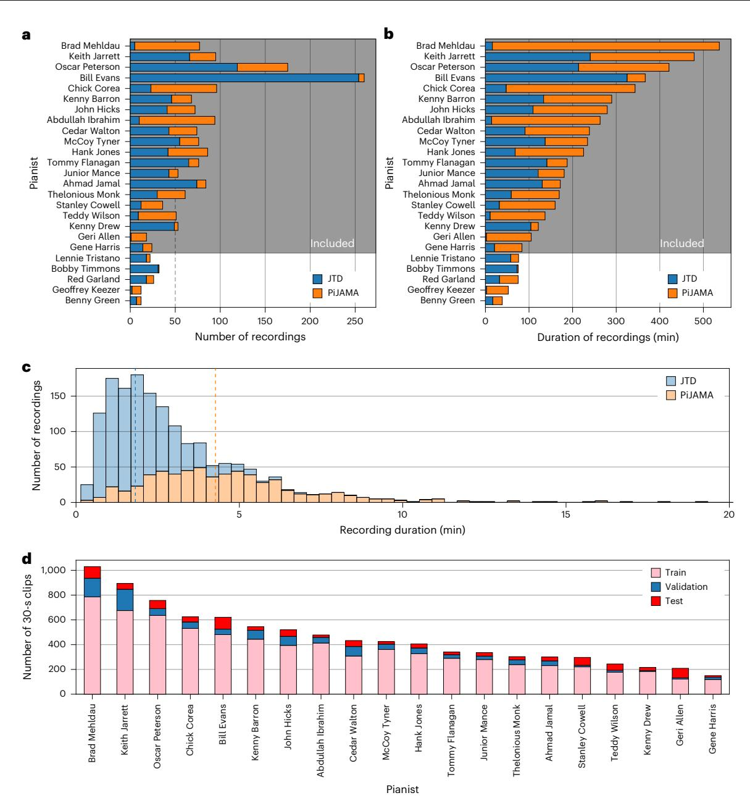

**Fig. 6 | Dataset. a**,**b**, Number of recordings by each pianist (**a**) and the total duration of their recordings (**b**), stratified by the source database. Pianists are sorted in the descending order by total duration, with the shaded area indicating when this is greater than 80 min. **c**, Distribution of recording durations across

tracks in both databases, with the dashed lines representing the median recording duration. **d**, Number of 30-s clips in each split of the dataset used to train the neural networks.

The hop size for each clip is 30 s during inference and varies between 15 and 30 s during training, as part of our data augmentation pipeline (see the 'Data augmentation' section). During training, the classification loss is calculated using class probabilities estimated separately from each clip. During evaluation, we produce a track-level accuracy metric comparable with the models trained on entire recordings in the 'Bag of features approach' section by averaging the class probabilities estimated across all clips taken from a single parent recording[19](#page-11-3).

### **Training the bag of features approach**

In the 'Bag of features approach' section, we train three classical supervised learning architectures to identify the pianist playing in each recording using a bag of distinct, identifiable features. These models are RF, SVMs with a linear kernel, and (regularized) multinomial LR. All three architectures have been widely used in previous computational models of musical performance[s3](#page-10-2)[,26](#page-11-6)[,62–](#page-12-3)[66.](#page-12-4) The implementations are taken from the scikit-learn (v. 1.5.1) Python librar[y67](#page-12-5). Note that every model is fit using the 'one-versus-all' strategy.

**Feature extraction.** Although these models could be trained on a wide variety of predictive features, we restrict ourselves to melodic patterns and chord voicings, as these can be extracted simply from a musical transcriptio[n68.](#page-12-6) For an analogous approach studying rhythmic features obtained from many of the same recordings considered here, see ref. [3.](#page-10-2)

Extracting melody from a symbolic representation of a polyphonic musical performance is a challenging task. Ideally, we would use a sophisticated algorithm that either simulates underlying cognitive procedures involved in melody perceptio[n69](#page-12-7) or that learns to identify melodies from large annotated corpora of polyphonic music. Some deep learning architectures do exist that attempt the latter task[70](#page-12-8), but we find that they perform badly on our data, with very few melody notes identified successfully and the majority of the output being empty (Extended Data Fig. 5 and Supplementary Fig. 1). A possible explanation is that the data used to train these models often does not include jazz piano performances.

A simpler method is the 'skyline' algorithm outlined in ref. [71,](#page-12-9) which extracts the note with the highest pitch among the concurrent notes played at every unique onset time. A similar method was previously used in ref. [72](#page-12-10) to extract melodic content from polyphonic jazz piano performances. The skyline algorithm has drawbacks—for instance, the extracted notes may 'leap' between accompaniment and melody. Nevertheless, when comparing the results of the algorithm with a random set of clips annotated manually by a jazz expert, we found strong agreement (Supplementary Section 1.5).

Before applying the algorithm, we quantize a transcription by 'snapping' the note onsets to the nearest 100 ms (that is, ten frames). This value is roughly equivalent to the duration of a triplet eighth note at the mean tempo of the recordings contained in the JT[D59](#page-11-38). We then apply the skyline and obtain a vector of pitch classes, from which we extract *n*-grams—that is, melodic 'chunks' obtained over a sliding window. In this way, we ensure that the length of the extracted *n*-grams does not directly correlate with the tempo of a performance (which would be the case if, for instance, the duration of the window was set to a fixed number of seconds). A similar approach to ours was previously used in ref. [73.](#page-12-11)

We then use heuristics to filter the extracted melodies, mitigating both the drawbacks of the skyline algorithm and several of the common failure states of automatic transcription models (see the 'Dataset' section). We delete *n*-grams that have a total span of more than 12 semitones. This removes cases where the skyline probably 'leaps' between melody and accompaniment, or where 'octave errors' occur in the output of the transcription model. Additionally, we discount appearances of *n*-grams with at least one duration greater than 2 s between successive offsets and onsets, before quantization. This removes cases where *n*-grams might span across phrase boundaries, or where notes are not detected by the transcription model. Note that 2 s is the approximate duration of one measure at the average tempo of the recordings contained in the JTD[59.](#page-11-38) Finally, we convert each *n*-gram into a transposition-invariant representation by computing the difference between successive pitch classes.

We use values of *n* ∈ {3, 4, 5, 6, 7} when extracting melodic patterns from each transcription. In Extended Data Fig. 6, we empirically demonstrate that these values of *n* are sufficient to achieve the ceiling accuracy for the LR model when predicting the held-out validation split of the dataset, and that using larger values of either min(*n*) or max(*n*) does not increase performance[62](#page-12-3). However, this does mean that some of our melodies obtained with lower values of *n* can more accurately be described as short patterns, rather than full-length phrases. Nonetheless, we note that learning such melodic 'chunks' does often form a key part of jazz pedagogy[29](#page-11-23). For an analogous procedure that solely considers longer melodic patterns in jazz, see ref. [41](#page-11-19).

To extract chord voicings from the MIDI transcription, we follow a method similar to ref. [74.](#page-12-12) First, we quantize the transcription to the nearest 100 ms according to the onset time of each note, as before. We keep quantized frames that contain *n*∈ {3, 4, 5, 6, 7} notes from each performance—in other words, chord voicings that contain between three (that is, triads) and seven notes. We discard chords with two or more leaps of greater than 15 semitones between two adjacent pitches in the chord, since such chords are more-or-less unplayable with an ordinary handspan, and so are likely to correspond to transcription errors instead. Finally, we convert each chord into a transposition-invariant representation by expressing every pitch in terms of the number of semitones it lies above the lowest note in the chord. Note that we choose not to subtract the skylined melody as the highest note of every chord could theoretically have both a harmonic and melodic function, such as in the 'locked hands' mode of a jazz piano performance[45.](#page-11-24)

We obtain counts for a total of 430,841 melodic patterns and 53,198 chord voicings (total features, 484,039) for the 1,629 recordings in the dataset. In Supplementary Fig. 2, we show the 50 most common 4-grams ranked by their total number of occurrences across the entire dataset. In Supplementary Fig. 3, we show the fifty 4-grams that occur in the greatest number of distinct recordings.

Similar to how text-based authorship models typically remove both frequent (that is, 'stop') and infrequent word[s75](#page-12-13), we then discard features contained in fewer than 10 and more than 1,000 recordings to reduce the size of the vocabulary. In Supplementary Fig. 4, we demonstrate that these thresholds appear to be optimal for our dataset, both when compared with alternate values and with no threshold.

This leaves 17,918 melodic patterns and 3,752 chord voicings (total features, 21,670), with the reduced number of features explainable by a large number of patterns and voicings that appear in very few recordings. We transform the matrix of feature counts to a normalized representation using the term frequency-inverse document frequency method, previously used for composer classification in ref. [62](#page-12-3). We find that the term frequency-inverse document frequency substantially improves the predictive accuracy compared with other techniques such as *z* transformation.

We show counts for the 20 chord voicings and melodic patterns that occur most frequently after filtering (Extended Data Fig. 7). Each pattern or voicing can be interpreted as showing the number of semitones away from an initial starting pitch, such that the feature (0, −1, −2, −3) becomes pitches (C, B, B♭, A) or alternatively (G, G♭, F, E). The melodic patterns that occur most often are either alternations of 'perfect' intervals (such as the octave (0, −12, 0) and fifth (0, −7, 0)) or scalar fragments (such as a descending chromatic scale (0, −1, −2, −3) or ascending minor scale (0, 2, 3, 5)). As might be expected, shorter patterns appear more frequently than longer ones, with the 20 most common patterns only containing three or four notes. Several of the chord voicings that occur most frequently can be understood with relation to familiar chord types, such as major (0, 4, 7) and minor (0, 3, 7) triads in the root position. Both first (0, 3, 8) and second (0, 5, 9) inversions of the major triad are also common, as are 'stacked' octave (0, 12, 24) and perfect fourth (0, 5, 10) intervals.

**Training.** The process used to train each of the three models is identical to that in ref. [3](#page-10-2). We generate a two-dimensional hyperparameter space (Supplementary Tables 1–3), randomly sample possible configurations of parameters from this space (with *N* = 1,000 iterations), fit the model to the training split of the dataset and measure the accuracy when predicting class labels for the validation split. We find that this number of iterations is sufficient to achieve optimal performance on the held-out validation data across all classifier types. We also find that using a Bayesian optimization techniqu[e76](#page-12-14) to tune hyperparameters achieves the same results as random sampling.

We then use the hyperparameter configuration that resulted in the highest validation accuracy to predict the class labels of the held-out test split, and report the accuracy for this subset of the data as the overall performance of the model. Following ref. [3—](#page-10-2)and, for consistency with the neural networks we introduce later—we do not retrain the model on the training and validation splits after selecting the optimal hyperparameter configuration. A single iteration takes approximately 20 s for the LR model, 211 s for the RF model and 31 s for the SVM model. All iterations run in parallel on a machine with 76 CPU cores.

**Extracting maximally predictive features.** In Section xx, we want to obtain both the most strongly predictive sets of *K* melodic patterns and *K* chord voicings, across all performers. To do so, we first fit the LR model to the entire dataset, using the recordings in the training, validation and testing splits. Note that as we fit this model using the one-versus-all strategy, we have a single weight per feature for every performer. This can be written as the matrix **W** ∈ℝ*I*×*J* , where *I* is the number of performers (20) and *J* is the number of features (21,670).

Next, we compute the absolute magnitude of each feature weight for every performer, and take the maximum across performers. This yields the vector of feature weights **X** ∈ℝ*J* , calculated as **X***j* = max*i*∈*I* ||**W***i*,*j* || ,∀*j* ∈ *J*. Next, we obtain the indices for both the top-*K* melodic patterns and top-*K* chord voicings (with *K* = 2,000, as before) by sorting **X**. This lets us obtain two separate subsets of features *j* ∈ *J*, each with length *K*: ℱmel for melodic patterns and ℱhar for chord voicings. Note that although it would be possible to use all patterns or voicings here, many of these would likely be either redundant or non-discriminative given the high dimensionality of the feature space, which could artificially deflate the correlations.

Similarly, we partition the full dataset into two subsets by recording context: ����solo for recordings in PiJAMA, and ����trio for recordings in JTD. We then refit the LR model separately on ����solo and ����trio, once using ℱmel as the feature space and once using ℱhar, yielding four weight matrices: **M**solo, **M**trio ∈ℝ*I*×*K* for melodic patterns and **H**solo, **H**trio ∈ℝ*I*×*K* for chord voicings.

For every performer *i*∈*I*, we then compute the Pearson correlation coefficient between the rows of the solo and trio weight matrices, separately for each feature type. Thus, *r* mel *i* = corr (**M**solo *i* , **M**trio *i* ), where **M**solo *i* and **M**trio *i* denotes the *i*th row of both matrices. A value of *r* mel *i* above 0 indicates that performer *i* uses melodic patterns similarly regardless of whether they are playing solo or with an ensemble; on the contrary, a value close to or below 0 suggests a meaningful divergence in musical cues across the two contexts.

# **Training the representation learning approach**

In the 'Representation learning approach' section, we evaluate two convolutional neural networks on our dataset. This type of network possesses a range of inductive biases that makes it effective at modelling musical performances in the symbolic domain. For instance, the convolution operation is equivariant to translation; if an input is shifted (for example, if a pitch pattern is transposed), so will the corresponding feature map. When applied to piano roll representations, which put time on the horizontal axis and pitch on the vertical axis, convolutional neural networks, therefore, capture both transposition invariance (the identity of a pitch pattern is preserved when played higher or lower) and temporal invariance (the identity of a pitch pattern is preserved when played earlier or later in a recording). Convolutional neural networks have outperformed both transformer and graph neural network architectures when identifying classical pianists from symbolic representations of their performances[23](#page-11-4).

The first model we test (CRNN) uses eight convolutional layers and a bidirectional gated recurrent unit followed by a fully connected layer and softmax function to generate class probabilities, as in ref. [19](#page-11-3). The second (ResNet) is the ResNet-50 model, which has previously been used for composer identification in symbolic music[20](#page-11-39),[32](#page-11-12), for identifying 'samples' in music audio recording[s77](#page-12-15), and for identifying artists from hand-drawn sketches[17](#page-11-1). Both models are implemented using the PyTorch (v. 2.4.1) Python librar[y78](#page-12-16). Further description of both models is provided in Supplementary Section 1.6.

**Input representation.** Following ref. [19,](#page-11-3) we train these models on 30-s clips extracted from every recording. Each clip is represented as a one-channel 'image' of shape (88, 3,000), where the channel dimension is the velocity of each note, scaled between 0 and 1 (where a value of 1 is equivalent to the note with the highest velocity in the clip). This has been shown to mitigate overfitting to any variation in dynamic range compression apparent between recordings[33](#page-11-13)[,34](#page-11-14)[,79.](#page-12-17)

The height of the input corresponds to the pitch range of the piano, with one piano key per bin; the width is the duration of the clip multiplied by the number of frames per second used by the transcription model. We do not downsample the width of the input due to the importance of microtiming in prior analyses of expressive jazz performances[3](#page-10-2),[26](#page-11-6)[,52,](#page-11-31)[64.](#page-12-18)

**Data augmentation.** We apply data augmentation to the recordings in our training split. Our augmentation pipeline jointly manipulates the pitch, time (that is, onset and offset) and velocity parameters of each note, as well as the hop between two successive 30-s clips (Supplementary Section 1.7). We assign a 50% probability that data augmentation will be applied to each clip seen during a single training epoch; in this way, our models learn both absolute and relative distinctions between pitch classes. Additionally, data augmentation typically improves the generalizability of a performer identification model[22](#page-11-40), which will be beneficial if our models are to be applied to unseen data—for example, in educational contexts.

**Training.** We train two versions of both models, with and without data augmentation. Each model is trained for 100 epochs on a single NVIDIA A100 GPU with categorical cross-entropy loss, which we noted was sufficient to minimize the validation loss. With the exception of batch size (which we set to 20), we tune hyperparameters for both models separately. For training the CRNN, we set the learning rate to 0.001 and use the Adam optimizer; for the ResNet, we use the hyperparameter configuration described in ref. [20](#page-11-39). After training, we use the saved model weights with the best accuracy on the validation split to predict the held-out test data, for compatibility with the process described earlier in the 'Training the bag of features approach' section. Training takes approximately 5 h for the ResNet and 6.5 h for the CRNN.

# **Training the multiple input representations approach**

In the 'Multiple input representations approach' section, we evaluate an architecture that learns to identify the pianist in a recording from four separate musical inputs, each representing the melodic, harmonic, rhythmic and dynamic components of a recording[39.](#page-11-7)

**Input representations.** Given a one-channel piano roll with the dimensionality (88, 3,000), we want to split this into four separate rolls, all with the same height and width but which contain the melodic, harmonic, rhythmic or dynamic content from the input. Although it would be possible to use different dimensions for each roll (for instance, representing each melody note using a single pixel), maintaining the same dimensionality ensures that each roll remains directly comparable with the original input and to one another (receiving, for instance, the same number of learnable parameters). We provide a brief description below of how each roll is created; further information is given in Supplementary Section 1.8.

Melody rolls are generated by quantizing and applying the skyline algorithm to the transcription (see the 'Feature extraction' section), setting the velocity of each note to binary, and adjusting the inter-onset interval for each note to a consistent value dependent on the total number of melody notes and the width of the input piano roll. Harmony rolls are generated by quantizing the transcription, keeping quantized frames with at least three notes, adjusting inter-onset intervals for notes within one bin, and binarizing the velocity of every note. Rhythm rolls maintain the onset and offset times for each note, but randomize the pitch (that is, height) and binarize the velocity. Dynamics rolls are generated by binning notes by onset time, setting their inter-onset intervals to a consistent value and randomizing their pitch—that is, maintaining only the initial velocity of each note.

**Model architecture.** Our proposed architecture uses four convolutional sub-networks to generate an *x*-dimensional embedding from every input roll. Each sub-network shares the same architecture, but the weights are updated separately. We test a range of architectures in our experiments, including 50-, 34- and 18-layer ResNets—the latter being the smallest implemented in PyTorch. We also test the CRNN architecture described in Supplementary Section 1.6. As a form of regularization, during training, we experiment with masking the outputs of particular sub-networks with zeros. There is a 10% chance that one, two or three sub-networks will be masked when processing a clip (that is, a 30% total probability of masking any number of sub-networks), with 70% probability that all four sub-networks will be used during prediction.

The outputs from each network are then stacked vertically to create an array with the shape (4, *x*). It would be straightforward to generate the final *x*-dimensional feature vector by either taking the average or maximum of the neurons in every 'column' of this array. However, this might not be sufficient to allow the model to capture interactions between different musical domains. Consequently, we experiment with using a self-attention layer (with between 4 and 16 heads) across embeddings before pooling. After aggregation, the resulting *x*-dimensional feature vector is fed into a fully connected layer (with dropout at a rate of 50%) and the softmax function to generate class probabilities. Extended Data Fig. 2 shows an outline of the proposed architecture.

**Training.** We train the model for 100 epochs with a batch size of 20, using 30-s clips and aggregating class probabilities to obtain track-level predictions. We use the Adam optimizer with categorical cross-entropy loss and a learning rate of 0.0001. Training takes between 12 and 21 h on a single NVIDIA A100 GPU, depending on the size of the model. We make a model car[d80](#page-12-19) available on the same open-source repository that contains the model code (see the 'Code availability' section).

We show the results for our experiments in Extended Data Table 3. The most accurate predictions of the held-out test recordings are obtained using the smallest ResNet with 18 layers; increasing the size of each sub-network beyond this decreases the performance, which would suggest that overparameterization occurs with larger architectures[23](#page-11-4). We find that accuracy does not improve with the addition of self-attention. This could imply that there are no meaningful interactions between the different musical domains as they are represented here. As the network has only a single fully connected layer, this would instead imply that the contributions of each sub-network are additive. Finally, we observe slight performance improvements from using masking.

### **Reporting summary**

Further information on research design is available in the Nature Portfolio Reporting Summary linked to this article.

# **Data availability**

The data that support the findings of this study are from two published datasets of symbolic musical transcription[s33,](#page-11-13)[59](#page-11-38). The preprocessed versions of the data and the checkpoints for the trained models are available (with no restrictions on availability) via Zenodo at [https://](https://doi.org/10.5281/zenodo.14774191) [doi.org/10.5281/zenodo.14774191](https://doi.org/10.5281/zenodo.14774191) (ref. [81\)](#page-12-20).

# **Code availability**

The code for this work is available via Zenodo at [https://doi.org/10.5281/](https://doi.org/10.5281/zenodo.20345004) [zenodo.20345004](https://doi.org/10.5281/zenodo.20345004) (ref. [82\)](#page-12-21). The Aeberscale algorithm developed for this work (Supplementary Section 1.1) is available via Zenodo at [https://](https://doi.org/10.5281/zenodo.20345077) [doi.org/10.5281/zenodo.20345077](https://doi.org/10.5281/zenodo.20345077) (ref. [83\)](#page-12-22). The web application developed as part of this work is accessible at [https://cms.mus.cam.ac.uk/](https://cms.mus.cam.ac.uk/jazz-piano-fingerprints-ml) [jazz-piano-fingerprints-ml](https://cms.mus.cam.ac.uk/jazz-piano-fingerprints-ml) and the relevant code is available via Zenodo at<https://doi.org/10.5281/zenodo.20345004>(ref. [82](#page-12-21)).

# **References**

- 1. Burrows, J. F. Delta': a measure of stylistic difference and a guide to likely authorship. *Lit. Linguist. Comput.* **17**, 267–287 (2002).
- 2. Łydżba-Kopczyńska, B. I. & Szwabiński, J. Attribution markers and data mining in art authentication. *Molecules* **27**, 70 (2022).
- 3. Cheston, H., Schlichting, J. L., Cross, I. & Harrison, P. M. C. Rhythmic qualities of jazz improvisation predict performer identity and style in source-separated audio recordings. *R. Soc. Open Sci.* **11**, 240920 (2024).
- 4. Setzu, M., Corbara, S., Monreale, A., Moreo, A. & Sebastiani, F. Explainable authorship identification in cultural heritage applications. *ACM J. Comput. Cult. Herit.* **17**, 44 (2024).
- 5. Abbasi, A. et al. Authorship identification using ensemble learning. *Sci. Rep.* **12**, 9537 (2022).
- 6. Abry, P., Wendt, H. & Jaffard, S. When van Gogh meets Mandelbrot: multifractal classification of painting's texture. *Signal Process.* **93**, 554–572 (2013).
- 7. Frieler, K., Höger, F. & Pfleiderer, M. Anatomy of a lick: structure and variants, history and transmission. In *Book of Abstracts of the Digital Humanities Conference* (2019).
- 8. Li, J., Yao, L., Hendriks, E. & Wang, J. Z. Rhythmic brushstrokes distinguish van Gogh from his contemporaries: findings via automated brushstroke extraction. *IEEE Trans. Pattern Anal. Mach. Intell.* **34**, 1159–1176 (2012).
- 9. Van Noord, N., Hendriks, E. & Postma, E. Toward discovery of the artist's style: learning to recognize artists by their artworks. *IEEE Signal Process. Mag.* **32**, 46–54 (2015).
- 10. Wölfflin, H. *Principles of Art History: The Problem of the Development of Style in Later Art* (Dover Publications, 1950).
- 11. Morelli, G. *Italian Painters: Critical Studies of Their Works* (John Murray, 1892).
- 12. Tymoczko, D. *Tonality: An Owner's Manual* (Oxford Univ. Press, 2023).
- 13. Hepokoski, J. A. & Darcy, W. *Elements of Sonata Theory: Norms, Types, and Deformations in the Late-Eighteenth-Century Sonata* (Oxford Univ. Press, 2006).
- 14. Cugny, L. *Analysis of Jazz: A Comprehensive Approach* (Univ. Press of Mississippi, 2024).
- 15. Bloom, H. *The Anxiety of Influence: A Theory of Poetry* (Oxford Univ. Press, 1973).

- 16. Spitzer, L. *Linguistics and Literary History: Essays in Stylistics* (Princeton Univ. Press, 1948).
- 17. Chirosca, G., Rădvan, R., Muşat, S., Pop, M. & Chirosca, A. Machine learning models for artist classification of cultural heritage sketches. *Appl. Sci.* **15**, 212 (2025).
- 18. Theophilo, A., Padilha, R., Andaló, F. A. & Rocha, A. Explainable artificial intelligence for authorship attribution on social media. In *Proc. IEEE International Conference on Acoustics, Speech and Signal Processing (ICASSP)* 2909–2913 (IEEE, 2022).
- 19. Kong, Q., Choi, K. & Wang, Y. Large-scale MIDI-based composer classification. Preprint at [https://arxiv.org/abs/2010.14805](http://arxiv.org/abs/2010.14805)
- 20. Kim, S., Lee, H., Park, S., Lee, J. & Choi, K. Deep composer classification using symbolic representation. In *Extended Abstracts for the Late-Breaking Demo Session of the 21st International Society for Music Information Retrieval Conference* [https://program.ismir2020.net/static/lbd/ISMIR2020-LBD-431](https://program.ismir2020.net/static/lbd/ISMIR2020-LBD-431-abstract.pdf) [abstract.pdf](https://program.ismir2020.net/static/lbd/ISMIR2020-LBD-431-abstract.pdf) (2020).
- 21. Tang, J., Wiggins, G. & Fazekas, G. Pianist identification using convolutional neural networks. In *Proc. 4th International Symposium on the Internet of Sounds* 1–6 (IEEE, 2023).
- 22. Yang, D. & Tsai, T. Composer classification with cross-modal transfer learning and musically-informed augmentations. In *Proc. 22nd International Society for Music Information Retrieval Conference* (eds Lee, J. H. et al.) 802–809 (2021).
- 23. Zhang, H., Karystinaios, E., Dixon, S., Widmer, G. & Cancino-Chacón, C. E. Symbolic music representations for classification tasks: a systematic evaluation. In *Proc. 24th International Society for Music Information Retrieval Conference* 848–858 (2023).
- 24. Clayton, M., Rao, P., Shikarpur, N., Roychowdhury, S. & Li, J. Raga classification from vocal performances using multimodal analysis. In *Proc. 23rd International Society for Music Information Retrieval Conference* 283–290 (ISMIR, 2022).
- 25. Mahmud Rafee, S. R., Fazekas, G. & Wiggins, G. HIPI: a hierarchical performer identification model based on symbolic representation of music. In *Proc. IEEE International Conference on Acoustics, Speech and Signal Processing (ICASSP)* 1–5 (IEEE, 2023).
- 26. Ramirez, R., Maestre, E. & Serra, X. Automatic performer identification in commercial monophonic jazz performances. *Pattern Recognit.* **43**, 1514–1523 (2010).
- 27. Falomir, Z., Museros, L., Sanz, I. & Gonzalez-Abril, L. Guessing art styles using qualitative colour descriptors, SVMs and logics. In *Artificial Intelligence Research and Development* 227–236 (IOS Press, 2009).
- 28. Monson, I. T. *Saying Something: Jazz Improvisation and Interaction* (Univ. Chicago Press, 1996).
- 29. Berliner, P. F. *Thinking in Jazz: The Infinite Art of Improvisation* (Chicago Univ. Press, 1994).
- 30. Levine, M. *The Jazz Theory Book* (Sher Music, 1995).
- 31. Kernfeld, B. *What to Listen for in Jazz* (Yale Univ. Press, 1995).
- 32. Foscarin, F., Hoedt, K., Praher, V., Flexer, A. & Widmer, G. Concept-based techniques for 'musicologist-friendly' explanations in a deep music classifier. In *Proc. 23rd International Society for Music Information Retrieval Conference* (eds Rao, P. et al.) 876–883 (2022).
- 33. Edwards, D., Dixon, S. & Benetos, E. PiJAMA: piano jazz with automatic MIDI annotations. *Trans. Int. Soc. Music Inf. Retr.* **6**, 89–102 (2023).
- 34. Rodríguez-Algarra, F., Sturm, B. L. & Dixon, S. Characterising confounding effects in music classification experiments through interventions. *Trans. Int. Soc. Music Inf. Retr.* **2**, 52 (2019).
- 35. Riley, X. & Dixon, S. Reconstructing the Charlie Parker Omnibook using an audio-to-score automatic transcription pipeline. In *Proc. 21st Sound and Music Computing Conference* 546–553 (2024).
- 36. Kong, Q. et al. High-resolution piano transcription with pedals by regressing onset and offset times. *IEEE/ACM Trans. Audio Speech Lang. Process.* **29**, 3707–3717 (2021).
- 37. Breiman, L. Statistical modeling: the two cultures. *Stat. Sci.* **16**, 199–215 (2001).
- 38. Rudin, C. et al. Amazing things come from having many good models. In *Proc. 41st International Conference on Machine Learning* 42783–42795 (PMLR, 2024).
- 39. Cheston, H. *Computational Modelling of Jazz Improvisation*. PhD thesis, Univ. Cambridge (2025).
- 40. Breiman, L. Random forests. *Mach. Learn.* **45**, 5–32 (2001).
- 41. Frieler, K., Höger, F., Pfleiderer, M. & Dixon, S. Two web applications for exploring melodic patterns in jazz solos. In *Proc. 19th International Society for Music Information Retrieval Conference* (eds Gómez, E. et al.) 777–783 (2018).
- 42. Conklin, D. Discovery of distinctive patterns in music. *Intell. Data Anal.* **14**, 547–554 (2010).
- 43. Naylor, J. *Jazz Vocab Book: Bill Evans. Jazz Vocab Series* (The Jazz Pursuit, 2024).
- 44. Naylor, J. *Jazz Vocab Book: Oscar Peterson. Jazz Vocab Series* (The Jazz Pursuit, 2024).
- 45. Levine, M. *The Jazz Piano Book* (Sher Music, 1989).
- 46. Lyons, L. *The Great Jazz Pianists: Speaking of Their Lives and Music* (Quill, 1983).
- 47. Ribeiro, M. T., Singh, S. & Guestrin, C. 'Why should I trust you?': explaining the predictions of any classifier. In *Proc. 22nd ACM SIGKDD International Conference on Knowledge Discovery and Data Mining (KDD)* 1135–1144 (ACM, 2016).
- 48. Zhang, H. & Dixon, S. Disentangling the Horowitz factor: learning content and style from expressive piano performance. In *Proc. IEEE International Conference on Acoustics, Speech and Signal Processing (ICASSP)* 1–5 (IEEE, 2023).
- 49. Ramoneda, P., Eremenko, V., D'Hooge, A., Parada-Cabaleiro,
  - E. & Serra, X. Towards explainable and interpretable musical difficulty estimation: a parameter-efficient approach. In *Proc. 25th International Society for Music Information Retrieval Conference* 520–528 (ISMIR, 2024).
- 50. Frieler, K., Pfleiderer, M., Zaddach, W.-G. & Abeßer, J. Midlevel analysis of monophonic jazz solos: a new approach to the study of improvisation. *J. New Music Res.* **45**, 143–162 (2016).
- 51. Weiß, C., Balke, S., Abeßer, J. & Müller, M. Computational corpus analysis: a case study on jazz solos. In *Proc. 19th International Society for Music Information Retrieval Conference* 416–423 (ISMIR, 2018).
- 52. Benadon, F. Slicing the beat: jazz eighth-notes as expressive microrhythm. *Ethnomusicology* **50**, 73–98 (2006).
- 53. Gridley, M. C. *Jazz Styles: History and Analysis* 5th edn (Prentice Hall, 1997).
- 54. Gioia, T. *The History of Jazz* 2nd edn (Oxford Univ. Press, 2011).
- 55. Riley, X. & Dixon, S. Filobass: a dataset and corpus based study of jazz basslines. In *Proc. 24th International Society for Music Information Retrieval Conference* 500–507 (2023).
- 56. Hamilton, M. & Pearce, M. Trajectories and revolutions in popular melody based on U.S. charts from 1950 to 2023. *Sci. Rep.* **14**, 14749 (2024).
- 57. Broze, Y. & Shanahan, D. Diachronic changes in jazz harmony: a cognitive perspective. *Music Percept.* **31**, 32–45 (2013).
- 58. Harrison, P. M. C. & Pearce, M. T. An energy-based generative sequence model for testing sensory theories of Western harmony. In *Proc. 19th International Society for Music Information Retrieval Conference* 160–167 (ISMIR, 2018).
- 59. Cheston, H., Schlichting, J. L., Cross, I. & Harrison, P. M. C. Jazz trio database: automated annotation of jazz piano trio recordings processed using audio source separation. *Trans. Int. Soc. Music Inf. Retr.* **7**, 144–158 (2024).

- 60. Solovyev, R., Stempkovskiy, A. & Habruseva, T. Benchmarks and leaderboards for sound demixing tasks. Preprint at [https://arxiv.](http://arxiv.org/abs/2305.07489) [org/abs/2305.07489](http://arxiv.org/abs/2305.07489)
- 61. Pfleiderer, M., Frieler, K., Abeßer, J., Zaddach, W.-G. & Burkhart, B. *Inside the Jazzomat: New Perspectives for Jazz Research* (Schott Campus, 2017).
- 62. Alvarez, D. A. P., Gelbukh, A. & Sidorov, G. Composer classification using melodic combinatorial *n*-grams. *Expert Syst. Appl.* **249**, 123300 (2024).
- 63. Deepaisarn, S. et al. NLP-based music processing for composer classification. *Sci. Rep.* **13**, 13228 (2023).
- 64. Eppler, A., Mannchen, A., Abeßer, J., Weiß, C. & Frieler, K. Automatic style classification of jazz records with respect to rhythm, tempo, and tonality. In *Proc. 9th Conference on Interdisciplinary Musicology* (eds Klüche, T. & Miranda, E.) 162–167 (Fraunhofer Institute for Digital Media Technology, 2014).
- 65. Saunders, C., Hardoon, D. R., Shawe-Taylor, J. & Widmer, G. Using string kernels to identify famous performers from their playing style. In *Machine Learning: ECML 2004* (eds Boulicaut, J.-F. et al.) 384–395 (Springer, 2004).
- 66. Widmer, G. & Zanon, P. Automatic recognition of famous artists by machine. In *Proc. 16th European Conference on Artificial Intelligence* (eds López de Mántaras, R. & Saitta, L.) 1109–1110 (IOS Press, 2004).
- 67. Pedregosa, F. et al. Scikit-learn: machine learning in Python. *J. Mach. Learn. Res.* **12**, 2825–2830 (2011).
- 68. Ens, J. & Pasquier, P. Quantifying musical style: ranking symbolic music based on similarity to a style. In *Proc. 20th International Society for Music Information Retrieval Conference* 870–877 (ISMIR, 2019).
- 69. Sauvé, S. A. *Prediction in Polyphony: Modelling Musical Auditory Scene Analysis*. PhD thesis, Queen Mary Univ. London (2018).
- 70. Chou, Y.-H., Chen, I.-C., Ching, J., Chang, C.-J. & Yang, Y.-H. MidiBERT-Piano: Large-scale pre-training for symbolic music classification tasks. *Journal of Creative Music Systems* **8** (2024)
- 71. Uitdenbogerd, A. L. & Zobel, J. Manipulation of music for melody matching. In *Proc. 6th ACM International Conference on Multimedia* 235–240 (Association for Computing Machinery, 1998).
- 72. Norgaard, M., Bales, K. & Hansen, N. C. Linked auditory and motor patterns in the improvisation vocabulary of an artist-level jazz pianist. *Cognition* **230**, 105293 (2023).
- 73. Cross, P. & Goldman, A. Interval patterns are dependent on metrical position in jazz solos. *Music Percept.* **39**, 299–312 (2022).
- 74. Bantula, H., Giraldo, S. & Ramirez, R. Jazz ensemble expressive performance modeling. In *Proc. 17th International Society for Music Information Retrieval Conference* (eds Mandel, M. I. et al.)674–680 (ISMIR, 2016).
- 75. Schonlau, M., Guenther, N. & Sucholutsky, I. Text mining with *n*-gram variables. *Stata J.* **17**, 866–881 (2017).
- 76. Bergstra, J., Bardenet, R., Bengio, Y. & Kégl, B. Algorithms for hyper-parameter optimization. In *Proc. 25th Intern[at](https://papers.nips.cc/paper_files/paper/2011/file/86e8f7ab32cfd12577bc2619bc635690-Paper.pdf)ional Conference on Neural Information Processing Systems* [https://papers.nips.cc/paper\\_files/paper/2011/file/86e8f7ab32cfd](https://papers.nips.cc/paper_files/paper/2011/file/86e8f7ab32cfd12577bc2619bc635690-Paper.pdf) [12577bc2619bc635690-Paper.pdf](https://papers.nips.cc/paper_files/paper/2011/file/86e8f7ab32cfd12577bc2619bc635690-Paper.pdf) (2011).
- 77. Cheston, H., Balen, J. V. & Durand, S. Automatic identification of samples in hip-hop music via multi-loss training and an artificial dataset. Preprint at [https://arxiv.org/abs/2502.06364](http://arxiv.org/abs/2502.06364) (2025).
- 78. Paszke, A. et al. PyTorch: an imperative style, high-performance deep learning library. In *33rd Conference on Neural Information Processing Systems* [https://proceedings.neurips.cc/paper\\_files/](https://proceedings.neurips.cc/paper_files/paper/2019/file/bdbca288fee7f92f2bfa9f7012727740-Paper.pdf) [paper/2019/file/bdbca288fee7f92f2bfa9f7012727740-Paper.pdf](https://proceedings.neurips.cc/paper_files/paper/2019/file/bdbca288fee7f92f2bfa9f7012727740-Paper.pdf) (2019).
- 79. Flexer, A. & Schnitzer, D. Effects of album and artist filters in audio similarity computed for very large music databases. *Comput. Music J.* **34**, 20–28 (2010).
- 80. Mitchell, M. et al. Model cards for model reporting. In *Proc. Conference on Fairness, Accountability, and Transparency* 220–229 (Association for Computing Machinery, 2019).
- 81. Cheston, H., Bance, R. & Harrison, P. Data from: Machine learning of artistic fingerprints in jazz. *Zenodo* [https://doi.org/10.5281/](https://doi.org/10.5281/zenodo.14774191) [zenodo.14774191.](https://doi.org/10.5281/zenodo.14774191)(2025).
- 82. Cheston, H. Code from: Machine learning of artistic fingerprints in jazz. *Zenodo* [https://doi.org/10.5281/](https://doi.org/10.5281/zenodo.20345004) [zenodo.20345004](https://doi.org/10.5281/zenodo.20345004) (2026).
- 83. Cheston, H. Aeberscale: a simple key-finding algorithm designed for jazz. *Zenodo* [https://doi.org/10.5281/](https://doi.org/10.5281/zenodo.20345077) [zenodo.20345077](https://doi.org/10.5281/zenodo.20345077) (2026).
- 84. Meredith, D. The ps13 pitch spelling algorithm. *J. New Music Res.* **35**, 121–159 (2006). **Acknowledgements** We thank S. Dixon, M. Clayton, D. Tymoczko, B. Sober and an anonymous reviewer for their helpful comments on several initial drafts of this work. Parts of this research previously formed part of a PhD thesis by the first author, published[39](#page-11-7) according to the requirements of the University of Cambridge. **Author contributions** H.C.: conceptualization, data curation, formal analysis, investigation, methodology, software, supervision, visualization, writing—original draft and writing—review and editing. R.B.: conceptualization, investigation and methodology. P.M.C.H.: conceptualization, supervision and writing—review and editing. **Funding** H.C. declares support for the research of this work from a PhD studentship from the Cambridge Trust (grant number 10615996). This study was performed using resources provided by the Cambridge Service for Data Driven Discovery (CSD3) operated by the University of Cambridge Research Computing Service [\(www.csd3.cam.](http://www.csd3.cam.ac.uk) [ac.uk](http://www.csd3.cam.ac.uk)), provided by Dell EMC and Intel using Tier-2 funding from the Engineering and Physical Sciences Research Council (grant number EP/T022159/1), and DiRAC funding from the Science and Technology Facilities Council [\(www.dirac.ac.uk](http://www.dirac.ac.uk)). **Competing interests** The authors declare no competing interests. **Additional information Extended data** are available for this paper at [https://doi.org/10.1038/s42256-026-01279-9.](https://doi.org/10.1038/s42256-026-01279-9) **Supplementary information** The online version contains supplementary material available at [https://doi.org/10.1038/s42256-026-01279-9.](https://doi.org/10.1038/s42256-026-01279-9) **Correspondence and requests for materials** should be addressed to Huw Cheston or Peter M. C. Harrison. **Peer review information** *Nature Machine Intelligence* thanks Barak Sober and the other, anonymous, reviewer(s) for their contribution to the peer review of this work. **Reprints and permissions information** is available at [www.nature.com/reprints](http://www.nature.com/reprints).

**Publisher's note** Springer Nature remains neutral with regard to jurisdictional claims in published maps and institutional affiliations.

**Open Access** This article is licensed under a Creative Commons Attribution 4.0 International License, which permits use, sharing, adaptation, distribution and reproduction in any medium or format, as long as you give appropriate credit to the original author(s) and the source, provide a link to the Creative Commons licence, and indicate if changes were made. The images or other third party material in this

article are included in the article's Creative Commons licence, unless indicated otherwise in a credit line to the material. If material is not included in the article's Creative Commons licence and your intended use is not permitted by statutory regulation or exceeds the permitted use, you will need to obtain permission directly from the copyright holder. To view a copy of this licence, visit [http://creativecommons.](http://creativecommons.org/licenses/by/4.0/) [org/licenses/by/4.0/.](http://creativecommons.org/licenses/by/4.0/)

© The Author(s) 2026

| Model | Feature Type | Top-1 | Top-2 | Accuracy (Track) Top-3 | Top-5 |
|-------|--------------|-------|-------|------------------------|-------|
| RF    | (a)          | 0.454 | 0.626 | 0.706                  | 0.785 |
| RF    | (b)          | 0.264 | 0.374 | 0.485                  | 0.571 |
| RF    | (c)          | 0.27  | 0.368 | 0.472                  | 0.589 |
| SVM   | (a)          | 0.687 |       |                        |       |
| SVM   | (b)          | 0.337 |       |                        |       |
| SVM   | (c)          | 0.356 |       |                        |       |
| LR    | (a)          | 0.767 | 0.859 | 0.896                  | 0.939 |
| LR    | (b)          | 0.307 | 0.454 | 0.577                  | 0.699 |
| LR    | (c)          | 0.344 | 0.448 | 0.571                  | 0.724 |

Model abbreviations refer to Random Forest (RF), Support Vector Machine (SVM), and Logistic Regression (LR). Feature type refers to (a) the chromatic scale steps used throughout Section 2.1, (b) the diatonic scale steps described in Supplementary Material, Section 1.1.3, and (c) identical to feature type (b), additionally controlling for the use of mode between pianists. Note that scores for the SVM at higher than top-1 accuracy cannot be provided due to limitations in the scikit-learn implementation of this model.

| Model     | Data Augmentation |       | Accuracy |
|-----------|-------------------|-------|----------|
|           |                   | Clip  | Track    |
| CRNN      | N                 | 0.594 | 0.769    |
| CRNN      | Y                 | 0.681 | 0.825    |
| ResNet-50 | N                 | 0.772 | 0.875    |
| ResNet-50 | Y                 | 0.805 | 0.944    |

Clip accuracy is the accuracy of 'raw' predictions made from each input clip. Track accuracy is the accuracy of predictions obtained from averaging the estimated class probabilities across all clips from the same initial recording (Section 4.1).

| Input Encoder | Attention Heads | Pooling | Augmentation | Masking |       | Accuracy |
|---------------|-----------------|---------|--------------|---------|-------|----------|
|               |                 |         |              |         | Clip  | Track    |
| ResNet-18     | 0               | Average | Y            | Y       | 0.767 | 0.913    |
| ResNet-34     | 0               | Average | Y            | Y       | 0.744 | 0.906    |
| ResNet-50     | 0               | Average | Y            | Y       | 0.707 | 0.863    |
| CRNN          | 0               | Average | Y            | Y       | 0.622 | 0.812    |
| ResNet-18     | 4               | Average | Y            | Y       | 0.691 | 0.825    |
| ResNet-18     | 8               | Average | Y            | Y       | 0.721 | 0.856    |
| ResNet-18     | 16              | Average | Y            | Y       | 0.707 | 0.844    |
| ResNet-18     | 0               | Max     | Y            | Y       | 0.753 | 0.906    |
| ResNet-18     | 4               | Max     | Y            | Y       | 0.683 | 0.831    |
| ResNet-18     | 0               | Average | N            | Y       | 0.644 | 0.789    |
| ResNet-18     | 0               | Average | Y            | N       | 0.743 | 0.863    |
| ResNet-18     | 0               | Average | N            | N       | 0.619 | 0.806    |

Note that, when the number of attention heads is 0, self-attention is not used.

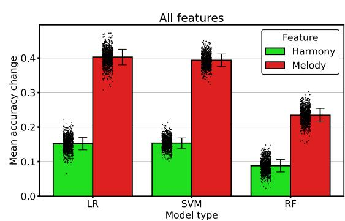

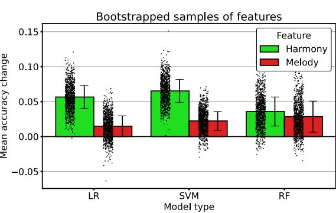

**Extended Data Fig. 1 | Feature importance by domain and model type.** Each bar shows the mean loss in test accuracy from permuting all melody or harmony features (left panel) and bootstrapped subsamples of 2,000 features (right

panel), stratified by model type. Data are presented as mean values with error bars showing ± 1 *SE* (with N = 1,000 bootstrap iterations). Corresponding data points are shown in the overlaid dot plots.

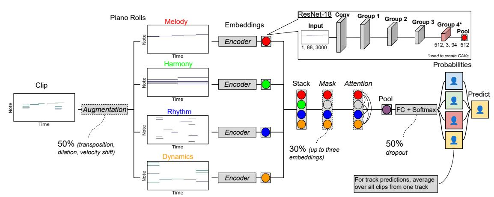

**Extended Data Fig. 2 | Proposed multi-input architecture.** An input transcription is represented using four piano rolls, each relating to a musical domain. Each roll is processed with a separate sub-network, the embeddings are then pooled, and class probabilities are generated. The architecture of

an 18- layer ResNet is shown here; different architectures are tested in our experiments (Extended Data Table 3). Optional components are represented with dashed lines.

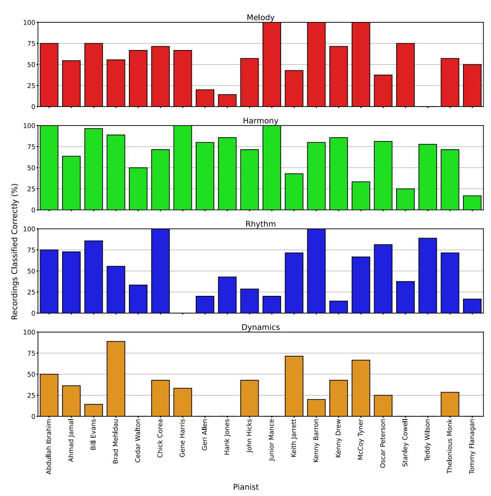

**Extended Data Fig. 3 | Class accuracy per musical domain.** Each facet shows the percentage of recordings in the held-out test split classified correctly for each pianist when predicting using only a single sub-network.

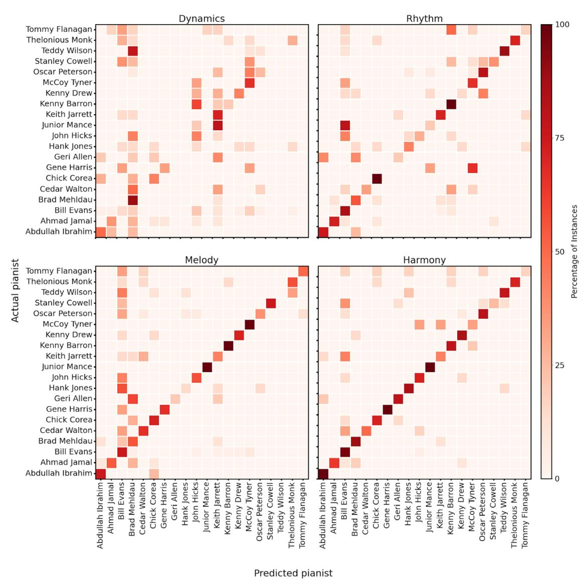

**Extended Data Fig. 4 | Class accuracy across musical domains.** Each facet contains a heatmap showing the probability that, when given a recording and the output from a sub-network, the model will identify a particular pianist. The

proportion of hits is shown for each facet along the diagonal; all other values are misses. Lighter and darker colours indicate lower and higher predictive probability, respectively.

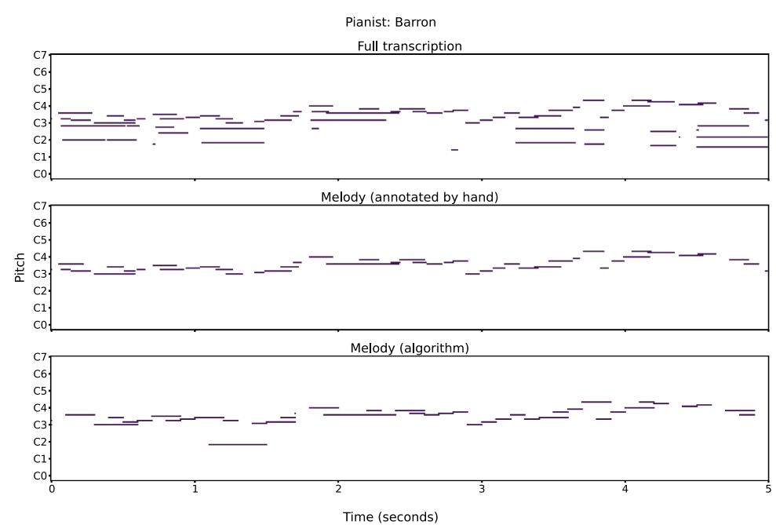

**Extended Data Fig. 5 | Melody extraction results.** The top panel shows five seconds of a MIDI transcription of a performance by Kenny Barron, the middle panel shows the melody in the same transcription as annotated by the first author (a jazz expert), and the bottom panel shows the same transcription after applying

the implementation of the 'Skyline' algorithm [71] used in this work. When the same transcription was processed using the model described by Chou et al. [70], no notes were detected as being part of the melody.

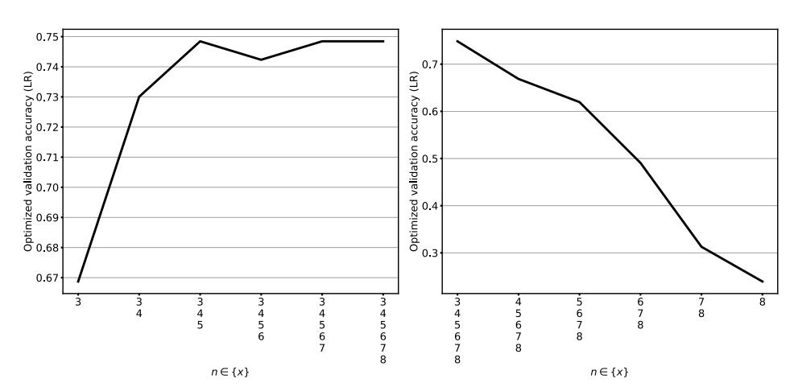

**Extended Data Fig. 6 | LR accuracy with different values of n.** The left panel shows changes in accuracy when the maximum value of n used to extract melody and harmony features increases, from 3 to 8 inclusive. The right panel shows equivalent changes when the minimum value of n increases. All accuracy

scores are the results of optimising hyperparameters separately using random sampling for each value of n (Section 4.2.2 in the full text) and are obtained for the validation split of the dataset.

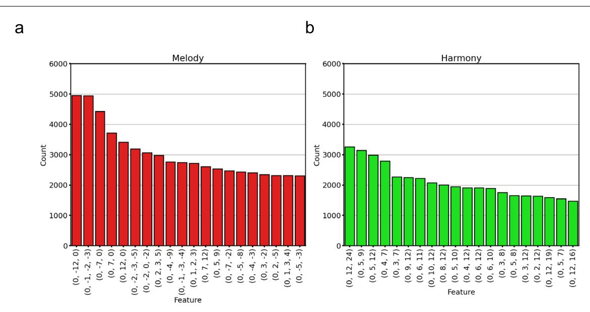

**Extended Data Fig. 7 | Feature counts.** Each panel shows the counts of the twenty most frequently occurring (**a**) melody and (**b**) harmony features across all recordings and splits of the dataset. The x-axis values can be interpreted as the number of semitones from an initial starting note.