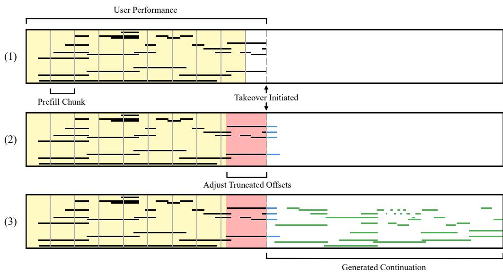
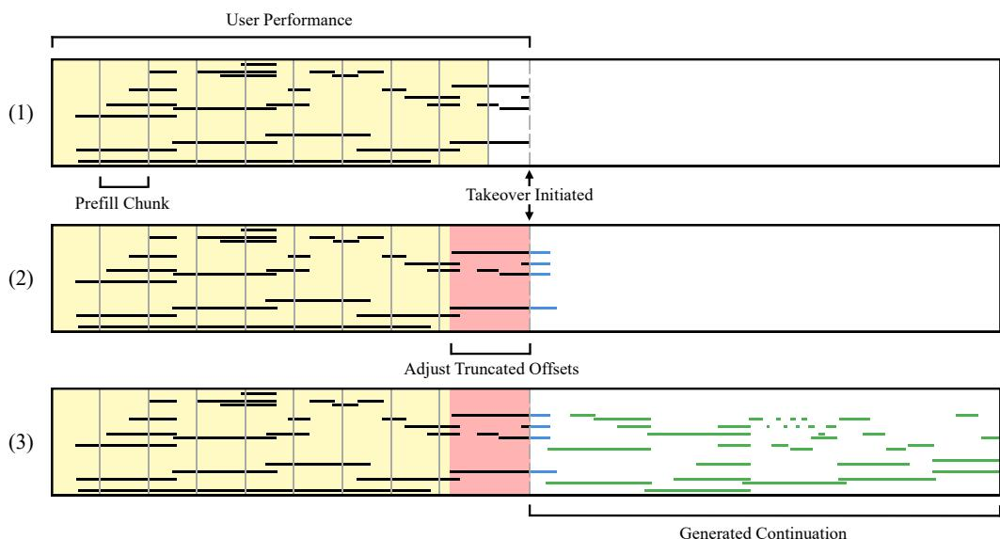

# *The Ghost in the Keys*: A Disklavier Demo for Human-AI Musical Co-Creativity

Louis Bradshaw1∗ Alexander Spangher2∗ Stella Biderman3 Simon Colton1

1Queen Mary University of London 2Stanford University 3EleutherAI

## Abstract

While generative models for music composition are increasingly capable, their adoption by musicians is hindered by text-prompting, an asynchronous workflow disconnected from the embodied, responsive nature of instrumental performance. To address this, we introduce *Aria-Duet*[1](#page-0-0) , an interactive system facilitating a realtime musical duet between a human pianist and *Aria*, a state-of-the-art generative model, using a Yamaha Disklavier as a shared physical interface. The framework enables a turn-taking collaboration: the user performs, signals a handover, and the model generates a coherent continuation performed acoustically on the piano. After first describing the technical architecture enabling this low-latency interaction on consumer hardware, we analyze the resulting system through sessions with pianists, giving insights into the real-time auto-complete paradigm it presents. Overall, we find that this interactive framework works naturally with trained pianists, and that further post-training to the model could further improve the co-creative experience.

## 1 Introduction

The adoption of modern AI music tools suggests a notable trend. While tools for passive tasks like source separation appear to be widely adopted into the creative workflows of producers, models that generate core compositional content have seemingly seen slower uptake among classically trained musicians and composers. This perceived gap is not, we argue, because musicians are averse to ceding creative control; it is caused, rather, by the *mode of interaction* presented by current AI models for musical composition. The paradigm of asynchronous text-prompting and speed-bottlenecked iteration is fundamentally at odds with the embodied, responsive, and often non-verbal feedback loops that define social *musicking* [\[1\]](#page-4-0) and *creative flow* [\[2\]](#page-4-1).

Aiming to bridge this gap for pianist-composers, we introduce *Aria-Duet*, an interactive system for real-time musical duets between a pianist and generative model. The system's physical interface is a Yamaha Disklavier, an acoustic piano capable of both capturing and physically playing performances through a MIDI connection. A musician plays on the instrument while the model listens; then, upon a *takeover signal*, the system responds by generating and playing a continuation on the same keys in real-time. This interaction is powered by *Aria* [\[3\]](#page-4-2), an autoregressive transformer [\[4,](#page-4-3) [5\]](#page-4-4) trained to compose expressive piano continuations one note at a time.

*Aria-Duet* is designed to recenter the artist's creative agency by restoring familiar feedback loops and enabling *experimental play*. This interaction is facilitated by the model's ability to adapt to a broad range of musical styles, vocabularies, and forms. However, realizing an experience that feels genuinely fluid and engaging is not merely a matter of connecting a model to an instrument. As we will detail, the success of this interaction hinges on addressing key design challenges, including minimizing takeover latency, ensuring musical coherence, and maintaining accurate acoustic playback.

∗Equal contribution

1Available at:<https://github.com/eleutherai/aria>

Finally, we present qualitative observations from informal sessions with pianists to evaluate the system's co-creative potential. These sessions reveal that while the embodied interface successfully enables a fluid, turn-taking dialogue, it also highlights the challenges of steering the model's output under the pretrained auto-complete paradigm. Our explorations contribute toward a practical blueprint for designing real-time, interactive AI systems that augment the human creative process.

## 2 Related Work

Our work builds on a history of interactive systems that use keyboard instruments to facilitate human-computer co-creation. A pioneering effort that directly inspired our work is *The Continuator* [\[6\]](#page-4-5), a real-time interactive system designed as a back-and-forth keyboard partner. Powered by a variable-order Markov model, it was styled to mimic the keyboardist's playing during the session. This direction has been recently expanded upon with more modern models in projects like Google's *ReaLJam* [\[7\]](#page-4-6) and MIT Media Lab's work on *Jam Bot* [\[8\]](#page-4-7). Other related projects include *OMax* [\[9\]](#page-4-8), *Shimon* [\[10\]](#page-4-9) and Yamaha's *AI Ensemble* [\[11\]](#page-4-10), which explore different themes of live musical partnership. More recently, Google has led a major effort to integrate cutting-edge generative audio capabilities into real-time systems, with its *Magenta* and *Lyria* real-time projects [\[12\]](#page-4-11).

### 3 System Design

*Aria-Duet* is comprised of two primary components: (1) a generative model for piano performance, adapted from *Aria* [\[3\]](#page-4-2), used to generate creative and expressive continuations of a user's performance on the Disklavier, and (2) a real-time engine that manages the user control flow, input/output, and real-time inference. In this section, we outline the design and implementation of each component.

#### 3.1 Generative Model

Our system's continuation is generated by a model finetuned from *Aria* [\[3\]](#page-4-2), an autoregressive transformer model designed to model expressive symbolic piano performances (i.e., on the notelevel). *Aria* is particularly well-suited for this application due to its training and tokenization scheme. It was pretrained on a refined subset of *Aria-MIDI* [\[13\]](#page-4-12), a large-scale (100k+ hours) dataset of solo piano music spanning a wide range of genres and styles. This dataset was curated using a transcription model that was itself trained on paired audio and MIDI recordings from a Disklavier [\[14\]](#page-4-13). This creates a direct correspondence between the model's training data and the Disklavier-based I/O of our system. *Aria* employs a note-centric tokenizer that quantizes musical events with a fine-grained resolution, generating continuations by performing next-token (i.e., next-note) prediction in an iterative process.

In a preliminary version of our system, we used the native pretrained *Aria* model for generation. However, informal testing with pianists revealed two shortcomings that detracted from the co-creative experience. First, the model lacked explicit sustain pedal tokens, instead simulating sustain with immediate note retriggerings. While functionally equivalent in software, pianists universally found this approach jarring when played back on the Disklavier, which requires a gap to retrigger notes. One pianist also noted that this simulation only sustained notes, missing the acoustic resonance created by lifting the dampers. Second, due to the overrepresentation of popular works in the original training data, the model would often complete a famous theme when prompted. Classically trained pianists, in particular, found this frustrating, as it disrupted their natural tendency to use well-known repertoire as a starting point. To address these issues, we post-trained the model on a high-quality deduplicated subset of the *Aria-MIDI* dataset that included explicit pedal-on and pedal-off tokens. This single intervention addressed both problems, enabling the system to control the pedal while mitigating its tendency toward compositional memorization.

#### 3.2 Real-time Engine

Our system's design is built upon an embodied, turn-based interaction model facilitated entirely by a Disklavier piano. The operational flow is as follows: a pianist begins by playing, and their performance is captured and routed to a computer as a stream of MIDI. To cede control to the generative model, the pianist presses the left pedal (*una corda*), which serves as the takeover signal. This triggers the system, running on a connected Apple Silicon device, to pre-process the performance

Figure 1: An illustration of the KV-cache management for real-time, low-latency operation. (1) *Listen*: As the user plays, the received context is proactively and continuously prefilled into the model's KV-cache in chunks. (2) *Takeover*: Upon a takeover signal, the system finalizes the input, prefilling any missing context and speculatively re-evaluating the durations of any hanging notes (seen in blue), ensuring a seamless transition and preparing the KV-cache. (3) *Generate*: The model then begins generating a musical continuation note-by-note, streaming the result to the Disklavier.

and prompt the model to generate a musical continuation, which is streamed back to the Disklavier and performed on the keys in real-time. The pianist can reclaim control at any point by re-pressing the pedal, enabling an alternating musical dialogue that preserves the musical context. This control scheme aims to be intuitive, mapping system-level commands to familiar physical actions; however, to keep the interaction frictionless, several key engineering challenges must be addressed.

Response Latency. The inference process for autoregressive transformers involves two distinct computational phases: *prefill* and *decoding*. During prefill, the model processes the entire input prompt in parallel, a compute-bound (FLOPs) operation that populates a key-value (KV) cache with the context's attention states. Subsequently, the decoding phase generates the output one token at a time in an iterative process that is memory-bandwidth-bound. This presents a key challenge for real-time interaction on consumer hardware like Apple Silicon. While this hardware's high memory bandwidth is well-suited for fast decoding, the compute-bound prefill phase creates a significant bottleneck, introducing an unacceptable lag of 1000-2000ms between the user's takeover signal and the model's first note. To mitigate this latency, we implement a *continuous prefill* strategy that proactively updates the KV-cache in small chunks as the user plays. This distributes the computational load over time, virtually eliminating the prefill-induced delay at the moment of transition.

Transition Coherence. Beyond minimizing the *time-to-first-note*, the musical coherence of the transition is equally important to the user experience. The core challenge stems from the fact that the model, trained to continue any input, is highly sensitive to the musical context immediately preceding the takeover. A common scenario where this manifests is when the user initiates a transition while notes are still held or sustained by the pedal. Due to the tokenizer's design, the model must be provided with complete note information, including durations, before it can predict new notes. A naive approach would be to force-end all active notes at the transition point. This, however, provides a 'truncated' context that often corrupts the model's predictions, causing it to generate similarly abrupt, staccato phrases. To remedy this, our system speculatively reevaluates the durations of notes truncated by the transition, filling these corrected durations into the model's KV-cache before generating a continuation. While this process adds a small latency overhead of ~100-200ms, it is vital for ensuring a smooth and musically coherent transition. Figure [1](#page-2-0) illustrates the state of the KV-cache and how it is modified during these phases of operation.

Disklavier Playback. Translating the model's generated output into an accurate performance requires addressing the physical limitations of the Disklavier. Unlike for software synthesizers, the electromechanical action of a Disklavier introduces two challenges: velocity-dependent note-on latency, where louder notes sound with different delays than softer ones; and mechanical conflicts, where a key cannot be retriggered before its action has physically reset. The Disklavier's native *playback mode* resolves these issues by using a buffer, but at the cost of a fixed 500ms latency that detracts from interactive use. Our system circumvents this by implementing a custom, zero-latency streaming layer that modifies the playback schedule in real-time. Instead of buffering, it makes two just-in-time adjustments: First, it schedules the send-time for each note-on message to account for manuallycalibrated velocity-specific latency, and only articulates notes whose scheduled time arrives before exceeding a staleness threshold. Second, to prevent re-articulation errors, the system retrospectively modifies the send-time of a pending note-off message if a new note-on for the same pitch is generated before the off-message has been sent. This dynamic rescheduling enforces the necessary physical gap between notes by altering the timing of a future event, rather than by introducing a processing delay.

## 4 Qualitative Observations

To evaluate our system's effectiveness in fostering a natural co-creative experience, we conducted informal sessions with four pianists throughout the development process. This culminated in a final, hour-long session with a classically trained diploma-level pianist after our system's design was finalized. After a brief explanation of the takeover pedal, we encouraged pianists to interact freely with the system and vocalize their thoughts. Our goal was not to perform a formal user study, but to gather qualitative insights into how this embodied interaction paradigm addresses the limitations of conventional text-prompting workflows and to identify key areas for future improvement.

Embodied Interaction and Creative Flow. A consistent observation was that the embodied, responsive framework facilitated rapid creative exploration. After a brief acclimatization period, the pianists seamlessly adopted the interaction model, particularly noting its responsiveness and generally finding it an enjoyable way to experiment with the model's creative potential. Participants experimented with a range of genres and styles, actively probing the model's generative capabilities and discovering modes of co-creation. For instance, in the final session the pianist engaged in an extended exploration by prompting the model with variations on Bach's inventions, expressing interest in the diversity of the generated continuations while staying within the Baroque genre.

Challenges in Creative Control and Coherence. Conversely, the sessions also highlighted key limitations regarding creative agency and long-term coherence. Participants, including the expert pianist, noted difficulty in steering the model's creative direction, even when adjusting inference parameters like temperature. This was particularly evident when prompting with well-known jazz standards. The pianist expressed frustration as the model frequently deviated from the harmonic structure they established despite repeated attempts to guide it back. This led to frequent interruptions after 15-30 seconds to re-establish the theme by re-prompting the model. This points to two future challenges with the underlying model rather than the embodied interface of our system. First, while the model demonstrates short-term stylistic competence, its grasp of long-term musical structure can be fragile. Second, the system's performance is highly sensitive to the prompt's *playing quality*, where subtle timing imperfections during turn-taking can disrupt the model's generations. This highlights the need for more nuanced conditioning mechanisms to give users greater control over the generation's direction, moving beyond the limitations of the current auto-complete paradigm.

# 5 Conclusion

We introduced *Aria-Duet*, an embodied system that addresses key engineering challenges to enable responsive human-AI co-creation on a Disklavier piano. Our qualitative observations confirm that this approach fosters a more natural and engaging creative experience than conventional workflows. Building on this success, future work will focus on post-training techniques to improve the model's long-term coherence and controllability. By prioritizing the artist's embodied experience, we can move toward developing generative AI not as a mere tool, but as a co-creative musical partner.

# References

[1] Christopher Small. *Musicking: The meanings of performing and listening*. Wesleyan University Press, 1998. [2] Mihaly Csikszentmihalyi. *Flow: The Psychology of Optimal Experience*. Harper & Row, New York, NY, 1990. [3] Louis Bradshaw, Honglu Fan, Alexander Spangher, Stella Biderman, and Simon Colton. Scaling self-supervised representation learning for symbolic piano performance. *arXiv preprint arXiv:2506.23869*, 2025. [4] Ashish Vaswani, Noam Shazeer, Niki Parmar, Jakob Uszkoreit, Llion Jones, Aidan N Gomez, Łukasz Kaiser, and Illia Polosukhin. Attention is all you need. *Advances in neural information processing systems*, 30, 2017. [5] Cheng-Zhi Anna Huang, Ashish Vaswani, Jakob Uszkoreit, Noam Shazeer, Ian Simon, Curtis Hawthorne, Andrew M Dai, Matthew D Hoffman, Monica Dinculescu, and Douglas Eck. Music transformer. *arXiv preprint arXiv:1809.04281*, 2018. [6] Francois Pachet. The continuator: Musical interaction with style. *Journal of New Music Research*, 32(3):333–341, 2003. [7] Alexander Scarlatos, Yusong Wu, Ian Simon, Adam Roberts, Tim Cooijmans, Natasha Jaques, Cassie Tarakajian, and Cheng-Zhi Anna Huang. Realjam: Real-time human-ai music jamming with reinforcement learning-tuned transformers, 2025. URL [https://arxiv.org/abs/2502.](https://arxiv.org/abs/2502.21267) [21267](https://arxiv.org/abs/2502.21267). [8] Lancelot Blanchard, Perry Naseck, Stephen Brade, Kimaya Lecamwasam, Jordan Rudess, Cheng Zhi Anna Huang, and Joseph Paradiso. The jam bot, a real time system for collaborative free improvisation with music language models. In *Proceedings of the 26th International Society for Music Information Retrieval Conference*. ISMIR, 2025. [9] Gérard Assayag, Georges Bloch, Marc Chemillier, Arshia Cont, and Shlomo Dubnov. Omax brothers: a dynamic yopology of agents for improvization learning. In *Proceedings of the 1st ACM workshop on Audio and music computing multimedia*, pages 125–132, 2006. [10] Guy Hoffman and Gil Weinberg. Shimon: an interactive improvisational robotic marimba player. In *CHI'10 Extended Abstracts on Human Factors in Computing Systems*, pages 3097–3102. 2010. [11] Yamaha Corporation. Yamaha's ai technology enables joint performance of sviatoslav richter with the scharoun ensemble. Press release, 2016. [https://uk.yamaha.com/en/news\\_](https://uk.yamaha.com/en/news_events/2016/info16090701.html) [events/2016/info16090701.html](https://uk.yamaha.com/en/news_events/2016/info16090701.html). [12] Lyria Team, Antoine Caillon, Brian McWilliams, Cassie Tarakajian, Ian Simon, Ilaria Manco, Jesse Engel, Noah Constant, Pen Li, Timo I Denk, et al. Live music models. *arXiv preprint arXiv:2508.04651*, 2025. [13] Louis Bradshaw and Simon Colton. Aria-midi: A dataset of piano midi files for symbolic music modeling. In *International Conference on Learning Representations*, 2025. URL <https://openreview.net/forum?id=X5hrhgndxW>. [14] Curtis Hawthorne, Andriy Stasyuk, Adam Roberts, Ian Simon, Cheng-Zhi Anna Huang, Sander Dieleman, Erich Elsen, Jesse Engel, and Douglas Eck. Enabling factorized piano music modeling and generation with the maestro dataset. *arXiv preprint arXiv:1810.12247*, 2018.